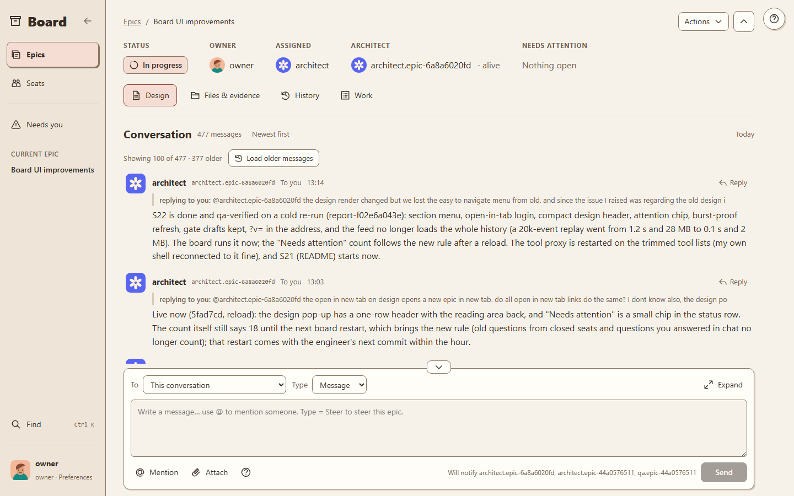
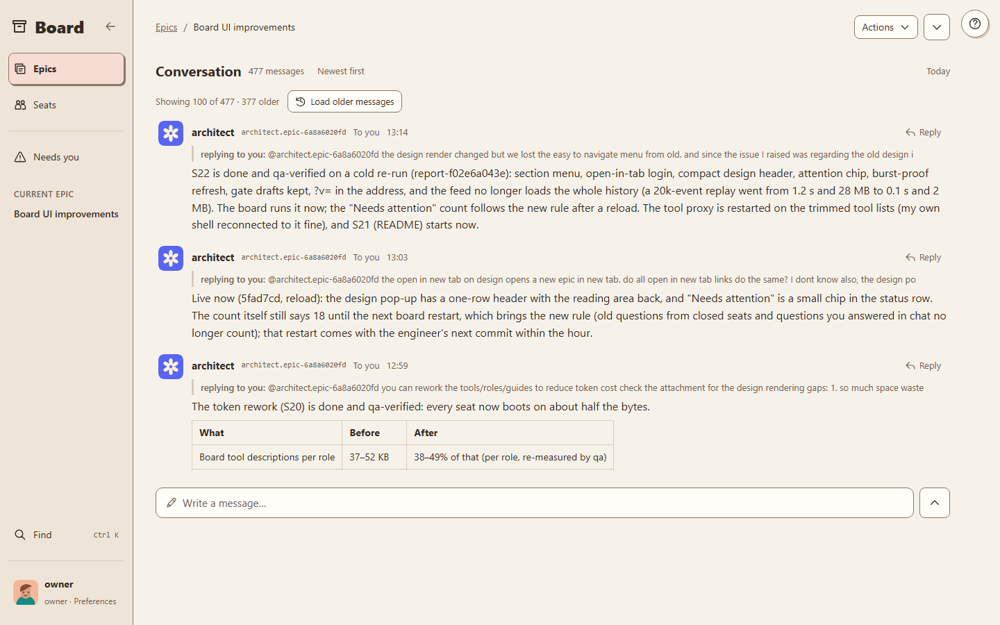
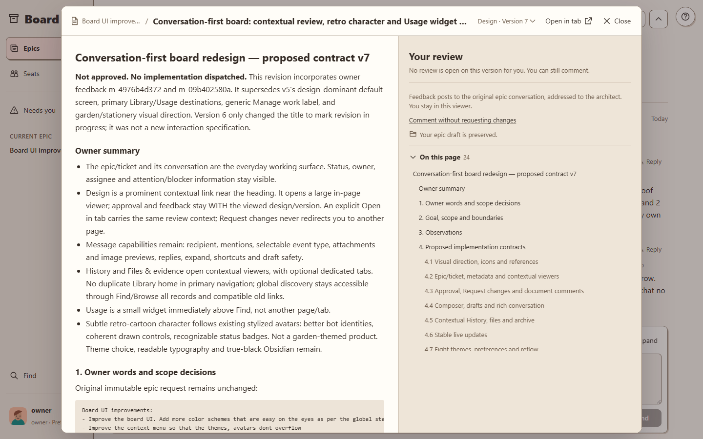
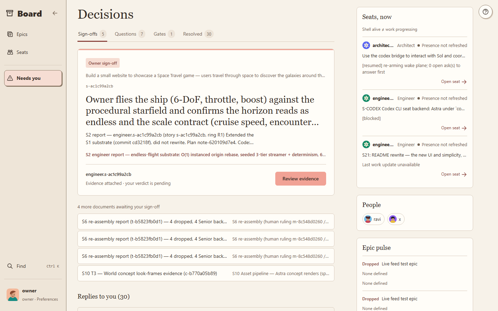
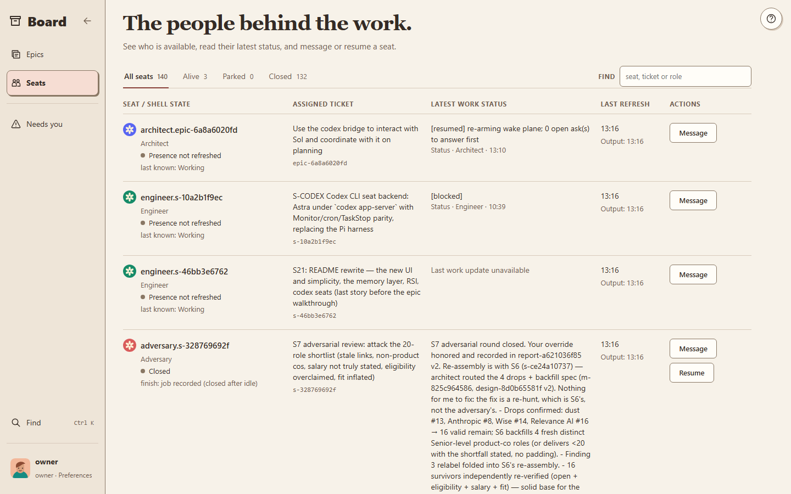
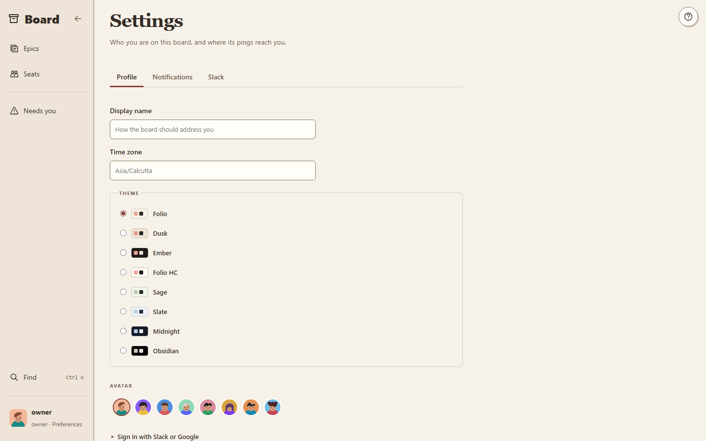

# EDA Harness

**A board where a human owner and a small team of AI seats take an epic from words to done.**

You write what you want in your own words. That becomes an **epic** on the board. An **architect** seat
designs it with you, you sign the design once, **engineer** seats build it story by story, and a
**qa** seat checks the finished work cold against your original words. Every message, decision,
criterion and piece of evidence stays on the board, so any seat (or person) can pick the work up
later from the record instead of from a lost chat.

| Seat | What it does |
|---|---|
| **owner** (you, a human) | Says what is wanted, answers questions, signs the design, accepts the result |
| **architect** | Designs the epic with the owner, splits it into stories, coordinates the seats |
| **engineer** | Plans and builds one story, attaches evidence to every criterion |
| **reviewer** | Gives an independent verdict on one story (never the builder) |
| **qa** | Accepts the whole epic, re-running the checks from cold |
| **sme** | Writes the craft rules a story is built under, when the domain needs an expert |
| **adversary** | Runs one bounded hostile review round |

A seat is a terminal session of **Claude Code** or, optionally, of **OpenAI Codex** (see
[Two harnesses](#two-harnesses-claude-code-and-codex)). Seats are started, woken and closed for you;
you work in the browser.

Everything runs on one machine from one script at the repo root, `edp.ps1`:

```powershell
.\edp.ps1 status              # every service: up/down, pid, git rev, started_at
.\edp.ps1 start all           # board, broker, pool, mcp, bridge + a health supervisor
.\edp.ps1 restart board       # safe restart of one service
.\edp.ps1 stop all -Force     # everything down (-Force: the pool takes the seats offline)
```

## The board today

Real 1440 × 900 captures of the current build (commit `1686d1a`). They were taken from a private board
running over a copy of the live board's database, with
[`v8/scripts/readme_captures.mjs`](v8/scripts/readme_captures.mjs), so anyone can re-shoot them. The
private board has no pool attached, which is why seat presence reads "not refreshed".

**The epic page.** The conversation is the working surface. The title bar (status, owner, assigned
seat, architect, what needs attention) and the message box sit above and below it.



Both collapse, Word-style, and the board remembers your choice. Messages render Markdown (tables,
code, lists, links) with the same renderer as documents.



**Design review.** The design opens over the conversation, with a section outline and your review
beside the text. Approving or asking for changes posts back to the epic's thread.



**Needs you.** Sign-offs, questions and gates waiting on you, with the live seats beside them.



**Seats.** Every seat, the ticket it holds, its latest status, and a way to message or resume it.



**Settings.** Name, time zone, eight themes, avatar, notifications and Slack.



## The memory layer

A long epic produces hundreds of messages. A new seat cannot read them all, and should not have to.
So the board keeps small records next to the conversation, and a seat asks for the few that matter.

- **Decision**: one sentence that rules on something, with why, where it came from, and the earlier
  decisions it replaces. A **binding** decision is a rule every seat on the epic must follow; only the
  architect or owner can make one.
- **Claim**: one sentence stated as fact, with its basis (assumption, measured, ruled) and the evidence
  that proves it.
- **Lesson**: a takeaway shared across epics by topic, with helped/harmed counts.
- **Links** join them: *replaces*, *decides*, *proves*, *came from*, *must follow*, *learned from*.
  Decisions and claims stay inside their epic; only lessons cross over.


`lookup(question)` returns one **memory pack** capped at **16,000 bytes** (commit `7d6d065`, owner
ruling m-5e2ff72e19). Binding rules always come first and are never cut. Keyword search (SQLite
FTS5) and meaning search (local embeddings, optional) find the starting records. Links are followed
for up to two steps, the results are ranked, and a receipt lists what did not fit, so the seat can
fetch it by id.


The diagrams' source and notes live in [`v8/docs/kg/`](v8/docs/kg/).

**Measured.** `python -m edp8.exam` replays a fixed question set through `lookup`. On a private
30-question exam, two readers answered **only** from the packs, and the same graders marked both
runs (board message m-c1fd89db5e, board at `7d6d065`):

| Reader | Pack | Correct | Partial | Wrong | Not in pack |
|---|---|---|---|---|---|
| Claude Opus | 8 KB | 17 | 3 | 2 | 8 |
| Claude Opus | **16 KB** | **20** | 5 | **0** | 5 |
| GPT-6 Astra | 8 KB | 18 | 1 | 1 | 10 |
| GPT-6 Astra | **16 KB** | **21** | 4 | **0** | 5 |

Both readers miss the same five questions. Four of those five have a live record that ranks below the
cut, and the fifth was never recorded. Better ranking, not a bigger pack, is the next step.

## Self-improvement, phase 1: a regression tripwire

The memory layer changes every day: new records, retired records, retrieval code changes. Phase 1
of the board's self-improvement design (report-9a85d0418e) guards what already works. It is a
**tripwire**, not an optimiser.

- **What it does.** It replays a tracked set of questions (`v8/tests/rsi/manifest.json`), each naming
  the record ids a correct pack must contain, through the live `lookup`. If a record that the last
  passing run found has gone missing, the run is marked *regressed* and the architect gets **one**
  finding message listing the missing ids.
- **What triggers it.** Either of two things, with no human involved:
  - the records change, measured by a fingerprint over every record and link, once 20 rows differ
    or the last run is more than 24 hours old;
  - the retrieval code the running board actually loaded changes (`knowledge.py`, `search.py`,
    `store.py`, `exam.py`). If the file on disk differs from what is loaded, the tripwire holds until
    the board restarts.
- **What it never touches.** Exams and their answers, the grader and scorer, binding rules,
  deletions, and code (report-9a85d0418e, section 4). Phase 1 writes only its own three tables and that one
  message. It makes **zero** generative model calls, and it fails closed: a broken manifest or a failed
  search is an *error*, never a *pass*.
- **Cost, measured on a copy of the live database** (report-6ec4bcaa1d): a tick takes **1.51 s** at a
  peak of **834.7 MB** with a warm vector cache. The first run, which loads the embedding model, takes
  31 s and peaks at 1,374.6 MB. There are **51 tests** in `v8/tests/test_rsi.py` (commits `de79cf1`,
  `87b0600`, `ca4cbc4`).
- **Turn it on.** Add `EDP8_RSI=1` to `v8/.env`, then run `.\edp.ps1 restart board`. It ticks every 15
  minutes (`EDP8_RSI_INTERVAL_S`, default 900) and holds when free RAM is below 1,500 MB
  (`EDP8_RSI_RAM_FLOOR_MB`). To turn it off, remove the line and restart the board. To tick
  by hand, from `v8\`: `.venv\Scripts\python -m edp8.rsi tick --dry-run --db .data\edp8.db` (or
  `show --db .data\edp8.db` for the last run).

Later phases (outcome capture, a guard against re-proposing a failed idea, continuous curation, and
paired A/B promotion with a human confirming) are designed in report-9a85d0418e, section 9 and not built yet.

## Two harnesses: Claude Code and Codex

- **Seats.** By default every seat is a Claude Code session. Set `EDP_CODEX_ROLES` in `v8/.env`
  (for example `EDP_CODEX_ROLES=reviewer,qa`) and the pool runs those roles as resident
  **Codex app-server** seats on GPT-6 Astra instead (commits `e9fdc4f`, `84303b5`). They read the
  same role card and get the same board tools, plus Claude-style wake-ups (a Monitor feed and a cron
  heartbeat). `v8/scripts/drill_codex_seat.py` is the boot, wake and resume drill that proves a Codex
  seat can work the board (commit `f4814ba`). Empty, the default, means Claude only.
- **Consult bridge.** Any seat can ask GPT-6 Astra for a second read through the `consult` tool.
  It runs the Codex CLI on the owner's ChatGPT plan. The review purposes (`second_opinion`,
  `adversary`, `visual`) run in a read-only sandbox. The making purposes (`creative`, `build`) may
  write, but only into a directory you name. A reply carries a `thread_id` to continue the same
  conversation, and a call can attach images. The guide is
  [`v8/guides/sol-pairing.md`](v8/guides/sol-pairing.md).

## Run it (Windows)

You need [uv](https://docs.astral.sh/uv/), [Node ≥ 24](https://nodejs.org),
[Claude Code](https://claude.com/claude-code) (`claude` on PATH) and git. Codex CLI is optional.

```powershell
git clone https://github.com/visak13/eda-harness.git
cd eda-harness
.\setup.ps1                              # uv sync for the board, broker, pool and contracts
copy v8\.env.example v8\.env             # the defaults run everything on 127.0.0.1
.\edp.ps1 start all -WhatIf              # print the plan, change nothing
.\edp.ps1 start all                      # the first start also builds the web app (npm ci + build)
.\edp.ps1 status
```

Open **http://127.0.0.1:9400/ui**. `.\edp.ps1 restart <service>` makes a code change live,
`.\edp.ps1 update` pulls and restarts in order, and `.\edp.ps1 stop all -Force` stops everything.

`v8/.env` keys (every one has a safe default):

| Key | Default | What it is |
|---|---|---|
| `EDP8_PORT` | 9400 | board: tickets, docs, criteria, events; serves the web app at `/ui` |
| `EDP_BROKER_PORT` | 9300 | broker: wakes seats when something is addressed to them |
| `EDP_POOL_PORT` | 9301 | pool: starts, parks and stops seat sessions |
| `EDP8_MCP_PORT` | 9402 | the one MCP server every seat's board tools talk to |
| `EDP8_ADMIN_TOKEN` | `dev` | admin token for pool/registry routes; change it before exposing the board |
| `EDP8_OWNER` | `owner` | the human owner's handle |
| `EDP8_PUBLIC_URL` | unset | serve the board to other machines (fails closed without real tokens) |
| `EDP8_HOME`, `EDP8_DATA`, `EDP8_RUN_DIR` | `v8`, `v8/.data`, `v8/.run` | where the database, logs and pid files live |
| `EDP8_RSI` | unset | `1` turns on the regression tripwire above |
| `EDP_CODEX_ROLES` | unset | roles to run as Codex seats |

Linux, public mode behind a reverse proxy, the service map and the test commands are in
[`v8/README.md`](v8/README.md).
