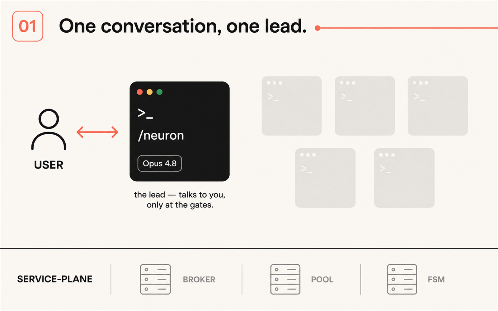
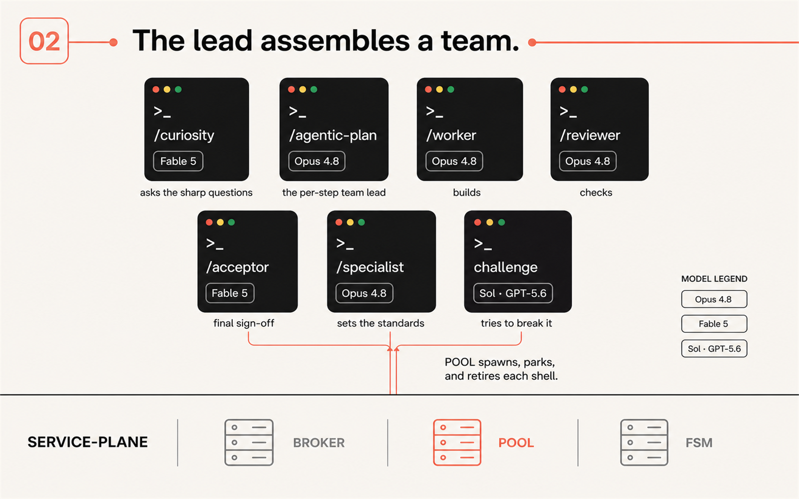
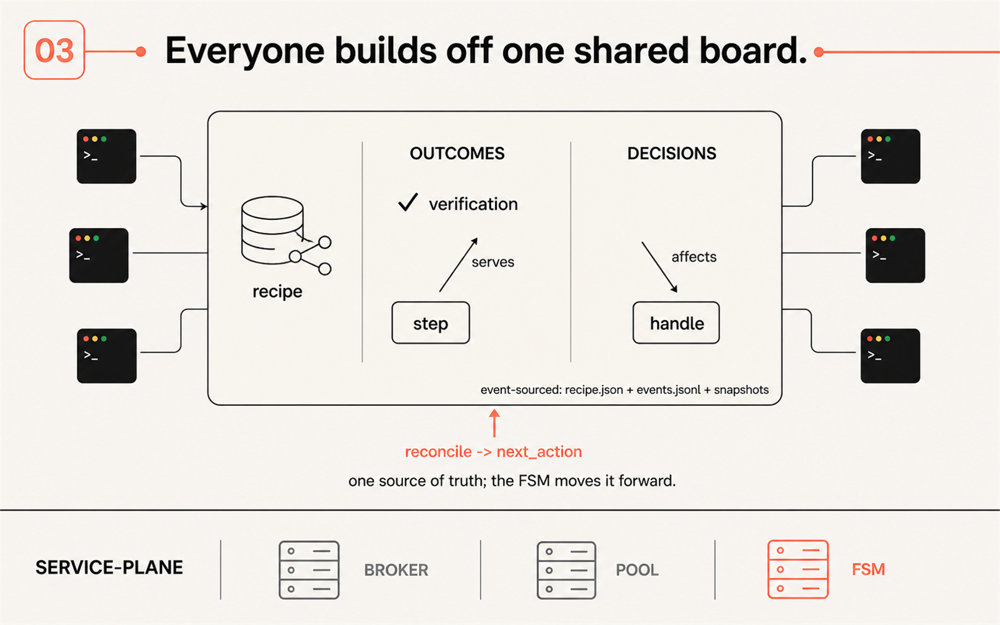
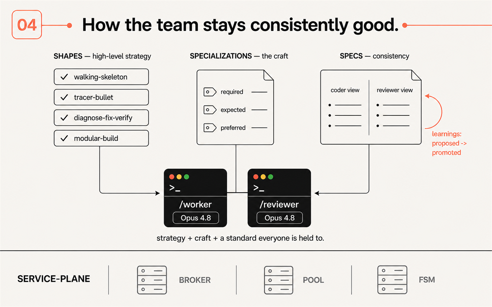
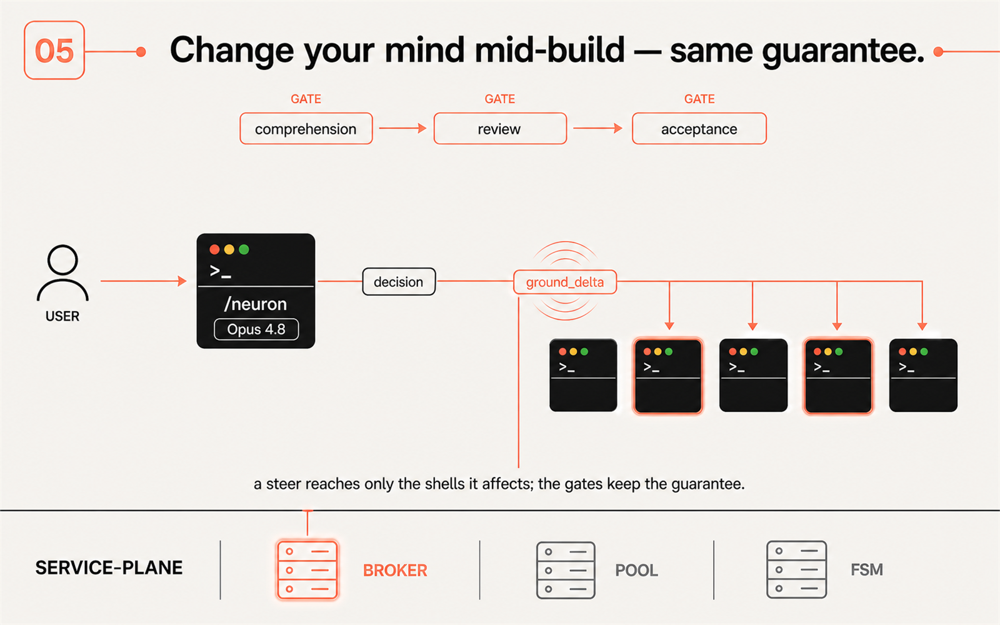
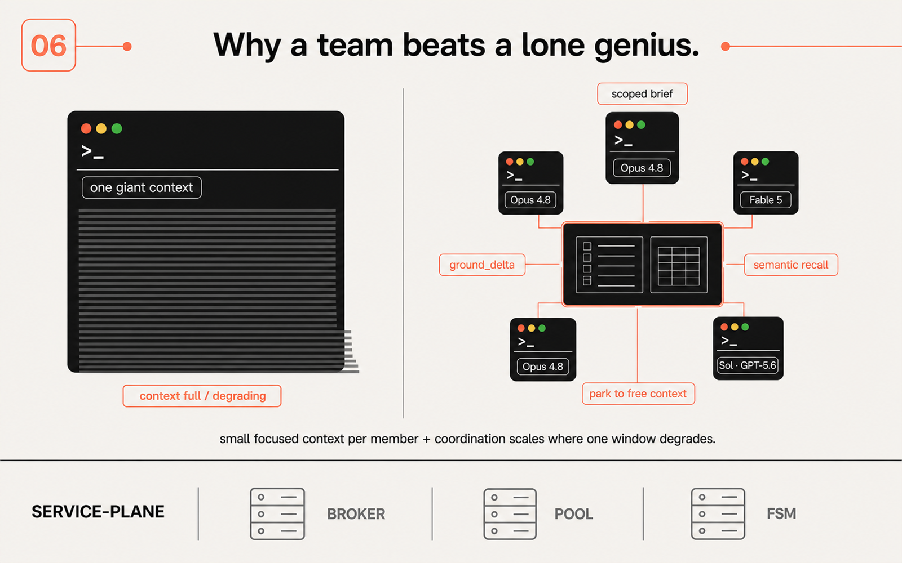

# EDA · Claude Harness

### Stay in the conversation. Let the system keep moving.

**An autonomous coding harness that runs like an engineering team — not a lone AI engineer.**
One conversation with a lead. A team of specialists working in parallel behind it.
A shared, durable source of truth so the work stays coherent — and stays *good* — even when you change your mind mid-build.

**▶ [Open the live visual walkthrough →](https://visak13.github.io/Harness-presentation/)**

---

You talk to **one** shell — the lead (`/neuron`). It owns the goal, routes the work, and comes back to you only at the moments that matter (the *gates*). Everything else happens as a coordinated background team.

## The 60-second tour

The whole framework, in six frames. (Or watch it interactively in the **[live presentation](https://visak13.github.io/Harness-presentation/)**.)

### 1 · One conversation, one lead
The `/neuron` shell is the only seat that talks to you, and only at gates. It never does the craft itself — it holds direction and routes.

### 2 · The lead assembles a team

Each role is its own focused Claude Code shell, spawned and retired by the **Pool**:

| Role | Command | Job | Model |
|---|---|---|---|
| Curiosity | `/curiosity` | Turns every papered-over ambiguity into a question you can answer | Fable 5 |
| Planner | `/agentic-plan` | The per-step team lead — authors a plan (a DAG of actions), drives its workers | Opus 4.8 |
| Worker | `/worker` | Executes one action, then closes | Opus 4.8 |
| Reviewer | `/reviewer` | Fresh eyes; re-checks the deliverable against the compiled standard | Opus 4.8 |
| Acceptor | `/acceptor` | Final sign-off — judges the delivery against your verbatim goal, fetching its own evidence | Fable 5 |
| Specialist | `/specialist` | The only seat that authors standards; learns a subject and compiles it | Opus 4.8 |
| Challenge | *(adversary)* | Tries to break the acceptance — an adversarial lens over the plan | Sol · GPT‑5.6 |

### 3 · Everyone builds off one shared board

Coordination isn't in a chat log — it's in a durable, **event‑sourced** record (`recipe.json` + `events.jsonl` + `snapshots`). Every step **serves** an outcome (work that serves no outcome is refused at the door). Every decision records what it **affects**. The **FSM** moves the plan forward one legal step at a time (`reconcile → next_action`). This shared board is *how* many agents stay coherent.

### 4 · How the team stays consistently good

Quality isn't hoped for — it's composed from three layers:

- **Shapes** — the *high‑level strategy*: how to attack a step (`walking-skeleton`, `tracer-bullet`, `diagnose-fix-verify`, `modular-build`, …).
- **Specializations** — the *craft*: each role's compiled playbook, with adherence tiers `required` / `expected` / `preferred`.
- **Specs** — *consistency*: the ruleset every build is held to, split into a coder view and a reviewer view. Learnings flow back (`proposed → promoted`) and recompile the standard, so the team gets better over time.

### 5 · Change your mind mid‑build — same guarantee

Steer at any point. Your change becomes a scoped **decision**; a **`ground_delta`** ripples through the **Broker** to *only the shells it affects* — the rest keep working, undisturbed. And the guarantees still hold, because they're gates in the machine, not good intentions: **comprehension → review → acceptance**.

### 6 · Why a team beats a lone genius

A single long‑context agent carries the entire goal, every decision, and all the rules in one window — and that window degrades as a whole. This harness keeps every shell's context *small and topical* (a scoped brief + a compiled spec + a shape checklist), refreshes only the shells a change actually touches, recalls durable truth semantically instead of re‑reading it, and releases context when a shell parks. **Small focused context per member + enforced coordination scales where one giant window degrades.**

## Why this is an upgrade over a single agent — or a traditional harness

- **A team, not a soloist.** Planning, building, reviewing, and accepting are *different seats with different standards* (and even different models — judgment on Opus 4.8, advisory on Fable 5, an adversarial lens on Sol/GPT‑5.6). No single window has to be good at everything at once.
- **Guarantees are enforced, not suggested.** Grounding, review, and acceptance are **record operations with write‑gates** — a step that serves no outcome is refused, a `done` without evidence is refused, acceptance fetches its *own* evidence from disk. A traditional prompt‑only harness relies on the model not drifting; here the machine won't let it.
- **You stay in control mid‑flight.** A steer becomes a scoped decision that reaches only affected work — you don't restart the run to change your mind, and you don't lose the guarantee by doing so.
- **It's durable.** The whole run is event‑sourced and snapshotted; it survives restarts, parks and resumes, and leaves an auditable trail.

## How it scales on a smaller context window

Better *context management* beats a bigger window:

- **Scoped grounding, not a mega‑prompt.** Each shell boots with only its leg — its action, a budgeted grounding brief, its concerns, and the outcome it serves. Domain knowledge arrives as a compiled ~15–30‑line spec doc, not raw rules.
- **Diff‑based re‑grounding.** A changed decision publishes one compact `ground_delta` digest to *only* the shells in its impact closure; everyone else keeps their context — and their prompt cache — intact.
- **Semantic recall instead of reloading.** Agents *ask* the record (`search_context`, embedding‑ranked) rather than reloading it; steady‑state shells never re‑read the whole recipe.
- **Disposable, right‑sized shells.** A shell runs one job and closes or parks (freeing context); steps are sized for parallelism and durable resume points, so the fixed boot cost is spent only where it buys something.

## The guarantees (gates)

`comprehension` (you approve the plan) · `adversarial challenge` · `outcome met + evidence` · `spec learnings triaged` · `clean tree` · `acceptance` (judged against your verbatim goal). Only after these does a recipe close `succeeded`.

---

**[▶ Explore the interactive presentation](https://visak13.github.io/Harness-presentation/)** · a visual index of the architecture

*Complex idea, simple to follow — an engineering team you drive with one conversation.*

## v8 (current, 2026-08-24)
The orchestration framework was rebuilt as **v8** (`v8/`): one Ticket object, a guarded board
(:9400, web UI at `/ui`), role-scoped MCP bundles, engineering-team roles (owner, coordinator,
architect, sme, engineer, reviewer, qa; GPT Sol as consultant). `start-v8.bat` / `stop-v8.bat`.
Spec: `claude/docs/design/FRAMEWORK-V8-DRAFT-v2.md` · log: `claude/docs/design/V8-DELIVERY-PLAN.md`.
The v7 commands are retired under `claude/.claude/commands-v7-retired/`.
