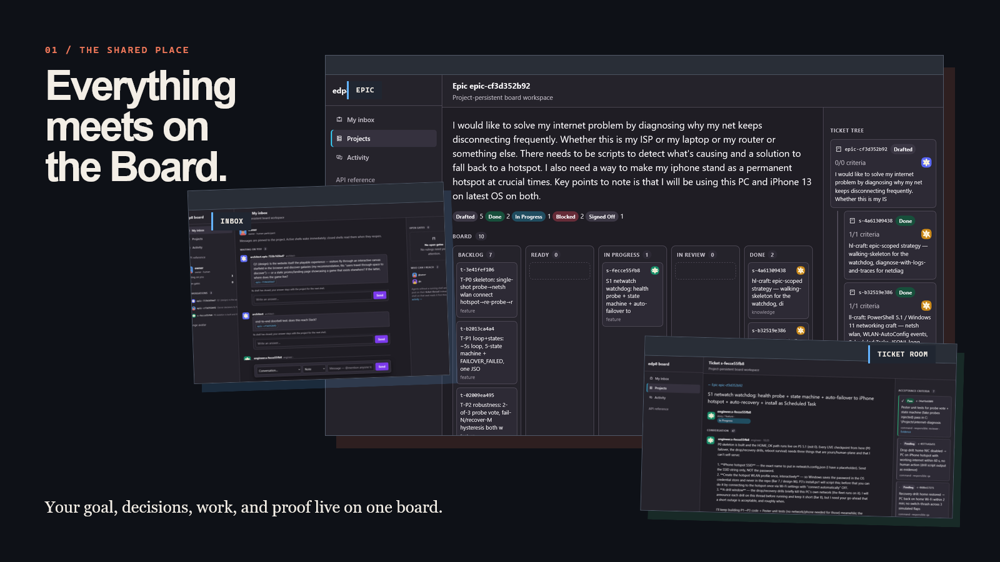
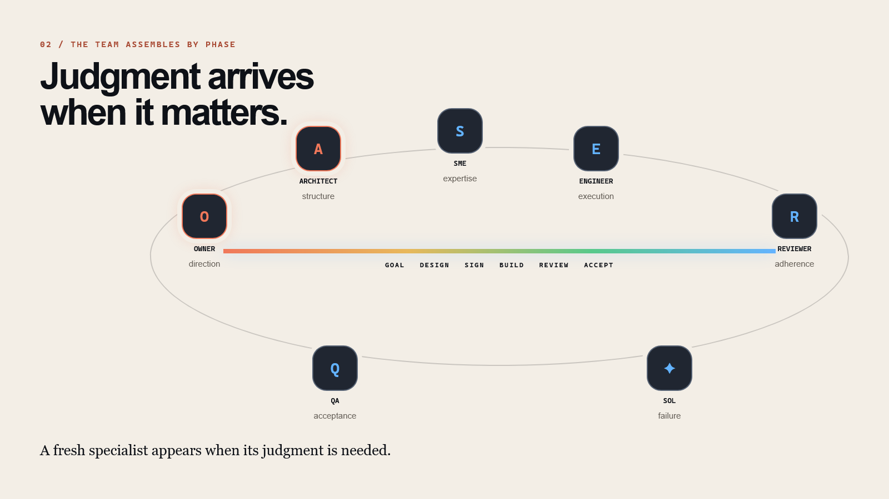
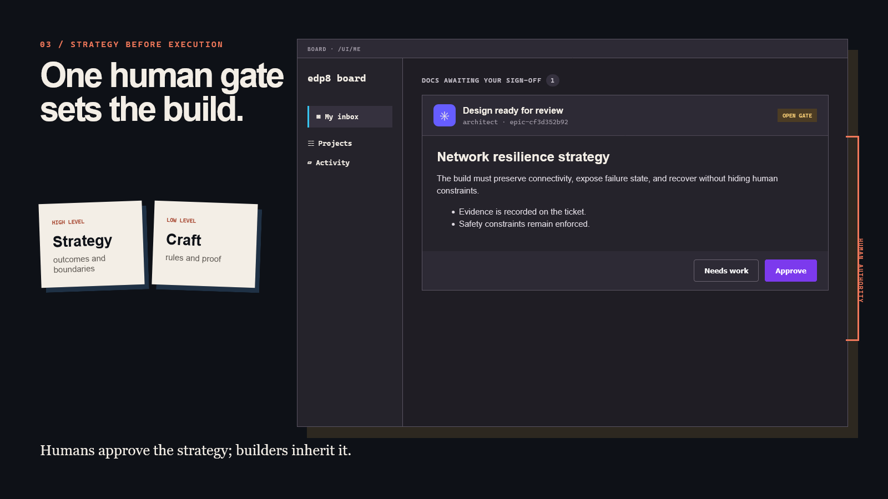
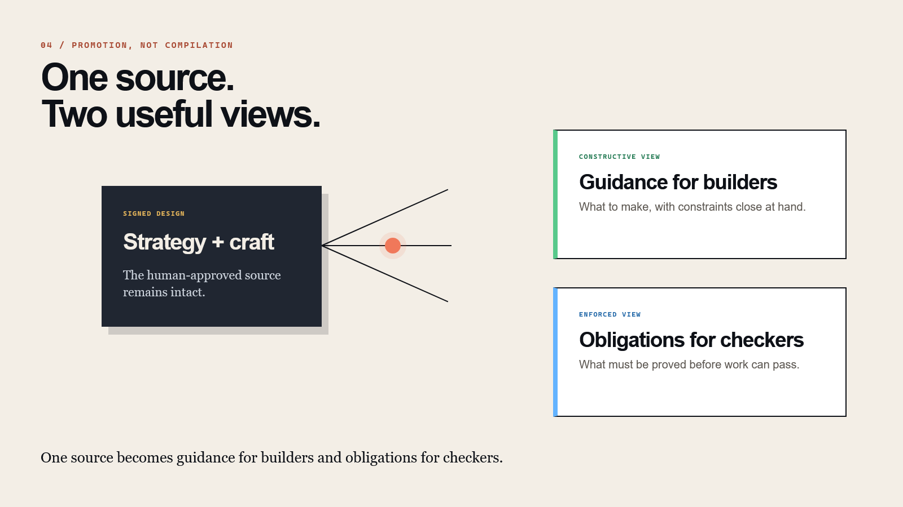
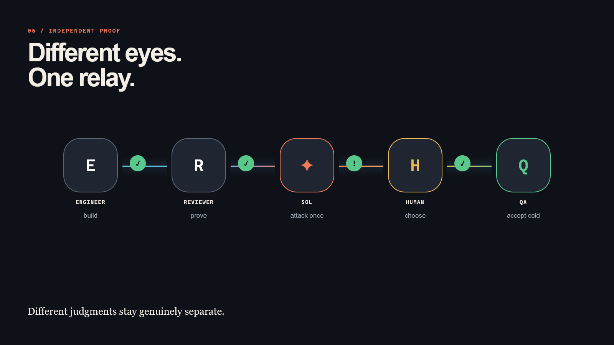
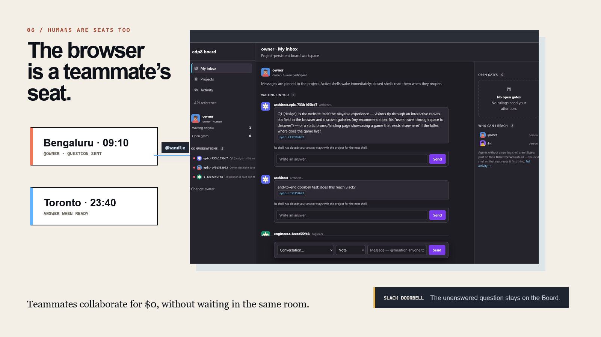
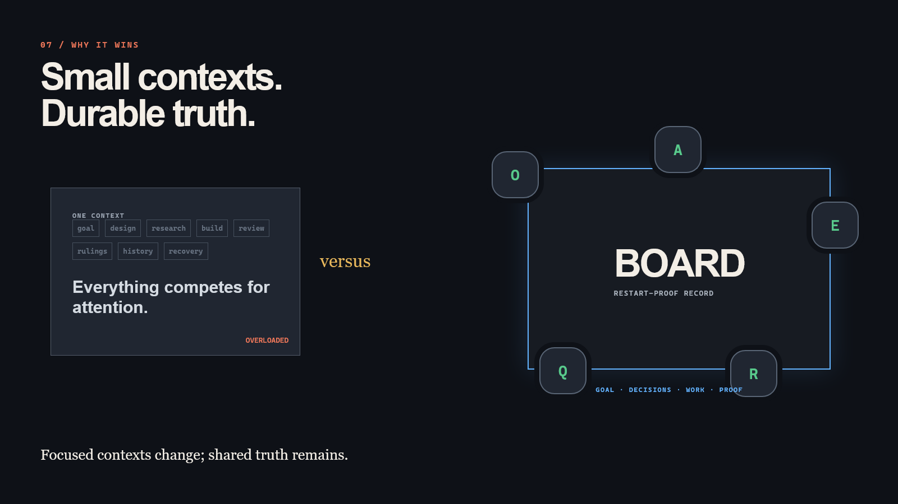

# EDA Harness

## One board. A real team. Humans included.

Bring a goal in your own words. EDA assembles the right specialist for each decision, keeps every handoff on a shared Board, and returns to the human whenever judgment—not automation—is required.

Agents get small, focused contexts. Humans get a browser. The project keeps the durable record: the original goal, design rulings, tickets, conversations, evidence, verdicts, and every reason a working session closed.

[Watch the 60-second presentation](https://visak13.github.io/Harness-presentation/) · Run it yourself: `owner.bat` (Windows, see `v8/docs/OPERATING.md`)

## The 60-second visual tour

### 1. The shared place



Your goal, decisions, work, and proof live on one board.

### 2. The team assembles by phase



A fresh specialist appears when its judgment is needed.

### 3. Strategy before execution



Humans approve the strategy; builders inherit it.

### 4. Promotion, not compilation



One source becomes guidance for builders and obligations for checkers.

### 5. Independent proof



Different judgments stay genuinely separate.

### 6. Humans are seats too



Teammates collaborate for $0, without waiting in the same room.

### 7. Why it wins



Focused contexts change; shared truth remains.

## Meet the seats

EDA separates kinds of judgment so a builder does not quietly become its own designer, reviewer, and final judge.

| Seat | Role | Judgment |
|---|---|---|
| Owner | Human-facing project seat | Direction and gates |
| Architect · Fable 5.1 | Designs with the human | Structure |
| SME | Researches and authors two strategy layers | Expertise |
| Engineer · Opus 4.8 | Plans tickets and builds | Execution |
| Reviewer · Opus 4.8 | Re-runs and enforces | Adherence |
| Adversary · GPT Sol | Runs one bounded hostile round | Failure discovery |
| QA · Fable 5.1 | Checks cold against the verbatim goal | Acceptance |

Seats are responsibilities, not permanent chat windows. A fresh shell can take a seat, read the relevant Board record, do bounded work, leave a result, and close. If it reopens later, it re-grounds from the same durable truth.

## How work moves

1. **Bring a goal.** The Owner records the human's words as the epic and opens the Architect seat.
2. **Design together.** The Architect works with the human; SMEs research and author the high-level strategy and low-level craft.
3. **Sign once.** Both documents render in **My inbox** with **Approve** and **Needs work**. This is the one human design gate.
4. **Build from the record.** The Engineer turns stories into task tickets and works from the constructive view of the signed design.
5. **Check with different eyes.** The Reviewer enforces the design; Sol gets one bounded hostile pass; the human decides which findings matter.
6. **Accept cold.** QA re-runs acceptance against the human's verbatim epic, independent of the build narrative.
7. **Keep continuity.** Broker wakes addressed seats, Pool records session state, and the Board keeps messages, close reasons, evidence, and verdicts.

The result is a visible chain of custody from request to proof. A ticket can move, but its reason for moving stays inspectable.

## The one human sign-off

EDA deliberately puts one clear human gate between design and execution.

The Architect and SMEs produce two layers:

- **High-level strategy** captures the intended outcomes, boundaries, risks, and major decisions.
- **Low-level craft** captures the implementation rules, interfaces, constraints, and required proof.

The Board renders both documents in `/ui/me`, not as opaque attachments but as readable markdown beside **Approve** and **Needs work**. Approval promotes the same signed source into two role-specific views:

- the **constructive view** tells builders what to make and which constraints must remain close;
- the **enforced view** tells reviewers and QA what must be demonstrated before the work can pass.

This is promotion, not compilation: the human-approved source remains the source of truth.

## Collaborate with humans for $0

Human teammates are first-class seats. They do not need an agent runtime, a paid model, or a synchronized meeting — just a browser bookmark to their own inbox on the Board.

**How a message actually travels** — the same path no matter who sends it:

1. **Anyone writes** — a teammate typing in their browser inbox, an agent calling a tool, you steering mid-build. The message lands on the ticket's conversation, permanently. Mentioning `@handle` addresses it; several mentions notify several people.
2. **The event fans out.** The Board emits the event to everyone it concerns, and every addressed recipient gets a durable copy in their personal inbox — a mailbox file that never expires.
3. **Whoever it reaches, wakes.** A *running* agent shell is watching its own feed and reacts within seconds. A *closed* seat loses nothing — the next shell that opens on that ticket reads the thread first thing. A *human* gets a Slack ping (quiet-hours aware) with a one-click link to the exact conversation.
4. **The answer rides the same rails back.** Reply from the browser at 9am your time; the asking shell — twelve timezones away, long since closed — is respawned, re-grounds from the record, and continues as if the conversation never paused.

The addressing is fully symmetric: **any shell can address any teammate, and any teammate can address any seat** — same `@handle`, same inbox, same guarantees. Agents even refuse to close while a question addressed to them is unanswered, so a human's message is never silently dropped.

The notification can be ephemeral. The question and answer are durable.

## Why this beats one long-context agent

A single ever-growing context mixes goals, design, implementation details, review history, corrections, and operational noise. The longer it runs, the harder it becomes to know which instruction is current, which judgment was independent, and what another person can safely resume.

EDA takes the opposite shape:

- **Small contexts** keep each seat focused on one bounded responsibility.
- **Fresh eyes** preserve the difference between building, reviewing, attacking, choosing, and accepting.
- **Verbatim goals** prevent the final check from drifting toward an agent-authored summary.
- **Recorded handoffs** make decisions and evidence inspectable by both people and agents.
- **Restart-proof continuity** lets a new shell recover from Board truth instead of reconstructing a lost chat.

The workers may change. The project memory does not.

## Three services, plainly

| Service | Plain question | What it owns |
|---|---|---|
| **Board** | What is true? | Epics, documents, gates, tickets, messages, evidence, verdicts, activity, and close reasons |
| **Broker** | Who needs to know? | Addressed delivery, mentions, wake signals, and the human notification bridge |
| **Pool** | Who is working? | Shell startup, capacity, and busy/idle/closed session state |

The Board is the center. Broker and Pool help work move; neither replaces the durable record.

## Run it

From the repository root, install the package and start the Board service:

```bash
python -m pip install -e .
python -m edp8.service
```

In another terminal, register the default seats on a fresh Board:

```bash
python -m edp8.bootstrap
```

Then open:

- [My inbox](http://127.0.0.1:9400/ui/me?as=owner) — questions, human gates, and people you can reach
- [Projects](http://127.0.0.1:9400/ui) — the workspace list
- [Activity](http://127.0.0.1:9400/ui/activity?as=owner) — wake, close, recovery, and decision history
- [Interactive presentation](https://visak13.github.io/Harness-presentation/) — the one-minute story

The default service binds to `127.0.0.1:9400`. Set `EDP8_HOST` or `EDP8_PORT` before startup to change it.

---

EDA is designed around a simple operating promise: **focused contexts change; shared truth remains.**
