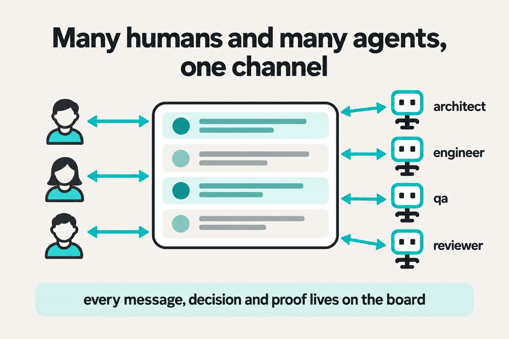
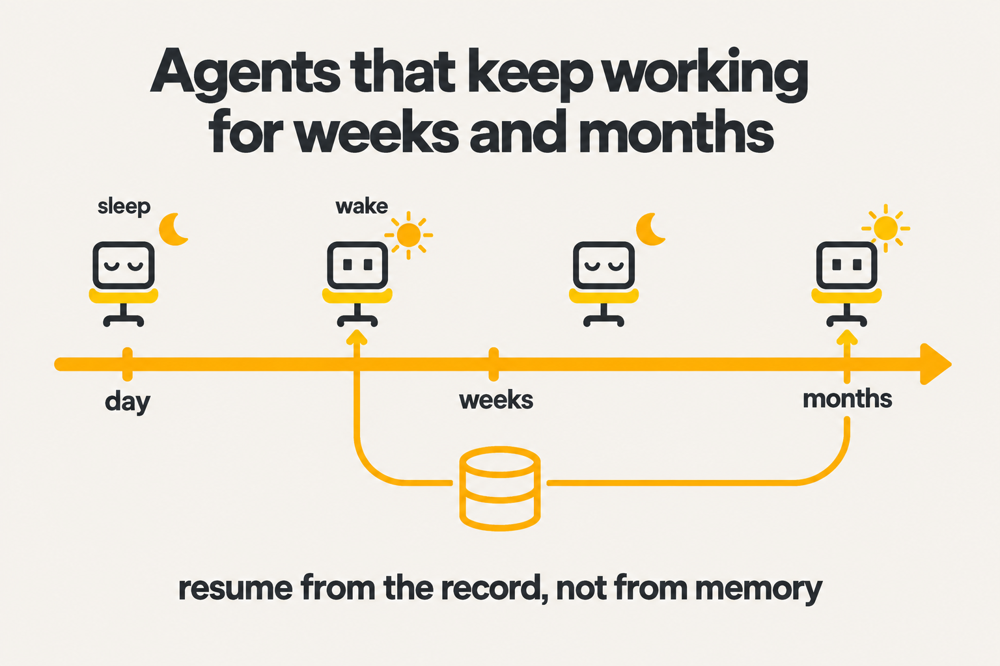
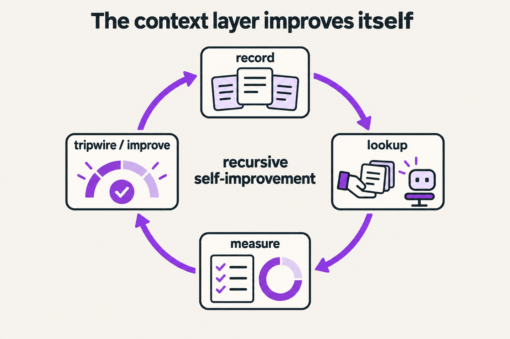
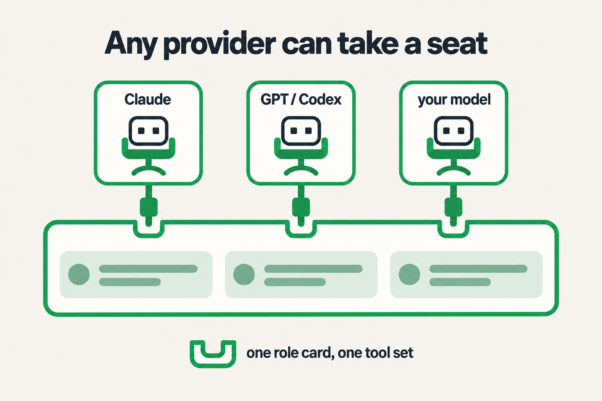

# EDA Harness

**A board where humans and AI agents work together on one channel, for as long as the work takes.**

You say what you want in your own words. A team of AI seats designs it with you, builds it, checks it
cold, and leaves every decision and proof on the board. Seats come and go; the record does not.
Its author built and used it for five months across thirty-plus apps before this milestone.

## Why this architecture

**1. Many humans and many agents, one channel.** No side chats, no lost context. Owner, architect,
engineers, reviewer and qa all speak on the same thread, and every message, decision, criterion and
piece of evidence lives on the board where anyone can read it later.



**2. Agents that keep working for weeks and months.** A seat is a terminal session; sessions crash,
hit limits, get closed. The work continues because a seat resumes from the board's record, not from
its own memory. This board's record holds over 200 seat session ends; the epics kept going.



**3. A context layer that improves itself.** Instead of re-reading a thousand messages, a seat asks
one question and gets a small pack of the decisions, claims and lessons that matter. The board
measures how good those packs are with a fixed exam, and a tripwire watches for regressions every
time the records or the retrieval code change. Read more: [the memory layer](docs/readme/memory-layer.md)
and [self-improvement](docs/readme/self-improvement.md).



**4. Any provider can take a seat.** A seat is a role card plus one tool set. Today a seat runs on
Claude Code or on OpenAI Codex, and any seat can ask the other model for a second read. The
framework does not care which model sits in the chair. Read more: [two harnesses](docs/readme/harnesses.md).



## How it works in one screen

You write an **epic**. An **architect** seat designs it with you and you sign the design once.
**Engineer** seats build it story by story, attaching evidence to every acceptance line. A
**reviewer** or **qa** seat gives the verdict; never the builder. You accept the result.

| Seat | What it does |
|---|---|
| **owner** (you, a human) | Says what is wanted, answers questions, signs the design, accepts the result |
| **architect** | Designs the epic with the owner, splits it into stories, coordinates the seats |
| **engineer** | Plans and builds one story, attaches evidence to every criterion |
| **reviewer** | Gives an independent verdict on one story (never the builder) |
| **qa** | Accepts the whole epic, re-running the checks from cold |
| **sme** | Writes the craft rules a story is built under, when the domain needs an expert |
| **adversary** | Runs one bounded hostile review round |

Seats are started, woken and closed for you; you work in the browser. Everything runs on one machine
from one script at the repo root, `edp.ps1`:

```powershell
.\edp.ps1 status              # every service: up/down, pid, git rev, started_at
.\edp.ps1 start all           # board, broker, pool, mcp, bridge + a health supervisor
.\edp.ps1 restart board       # safe restart of one service
.\edp.ps1 stop all -Force     # everything down (-Force: the pool takes the seats offline)
```

## The board today

Real 1440 × 900 captures of the current build (commit `1686d1a`). They were taken from a private board
running over a copy of the live board's database, with
[`v8/scripts/readme_captures.mjs`](v8/scripts/readme_captures.mjs), so anyone can re-shoot them. The
private board has no pool attached, which is why seat presence reads "not refreshed".

**The epic page.** The conversation is the working surface. The title bar (status, owner, assigned
seat, architect, what needs attention) and the message box sit above and below it.


Both collapse, Word-style, and the board remembers your choice. Messages render Markdown (tables,
code, lists, links) with the same renderer as documents.


**Design review.** The design opens over the conversation, with a section outline and your review
beside the text. Approving or asking for changes posts back to the epic's thread.


**Needs you.** Sign-offs, questions and gates waiting on you, with the live seats beside them.


**Seats.** Every seat, the ticket it holds, its latest status, and a way to message or resume it.


**Settings.** Name, time zone, eight themes, avatar, notifications and Slack.


## Deeper reading

- [The memory layer](docs/readme/memory-layer.md): decision, claim and lesson records, links, the 16 KB lookup pack and the measured exam scores.
- [Self-improvement, phase 1](docs/readme/self-improvement.md): the regression tripwire, what triggers it, what it never touches, how to turn it on.
- [Two harnesses](docs/readme/harnesses.md): Claude Code and Codex seats, and the consult bridge between them.
- [Diagram sources](v8/docs/kg/) and the [service map, Linux and public mode](v8/README.md).

## Run it (Windows)

You need [uv](https://docs.astral.sh/uv/), [Node ≥ 24](https://nodejs.org),
[Claude Code](https://claude.com/claude-code) (`claude` on PATH) and git. Codex CLI is optional.
Run these in Windows PowerShell from any folder:

```powershell
git clone https://github.com/visak13/eda-harness.git
cd eda-harness
.\setup.ps1                              # web + Python dependencies for every service; builds the web app
copy v8\.env.example v8\.env             # the defaults run everything on 127.0.0.1
.\edp.ps1 start all -WhatIf              # print the plan, change nothing
.\edp.ps1 start all                      # board, broker, pool, mcp, bridge + supervisor
.\edp.ps1 status
```

Open **http://127.0.0.1:9400/ui**. `.\edp.ps1 restart <service>` makes a code change live,
`.\edp.ps1 update` pulls and restarts in order, and `.\edp.ps1 stop all -Force` stops everything.

`v8/.env` keys (every one has a safe default):

| Key | Default | What it is |
|---|---|---|
| `EDP8_PORT` | 9400 | board: tickets, docs, criteria, events; serves the web app at `/ui` |
| `EDP_BROKER_PORT` | 9300 | broker: wakes seats when something is addressed to them |
| `EDP_POOL_PORT` | 9301 | pool: starts, parks and stops seat sessions |
| `EDP8_MCP_PORT` | 9402 | the one MCP server every seat's board tools talk to |
| `EDP8_ADMIN_TOKEN` | `dev` | admin token for pool/registry routes; change it before exposing the board |
| `EDP8_OWNER` | `owner` | the human owner's handle |
| `EDP8_PUBLIC_URL` | unset | serve the board to other machines (fails closed without real tokens) |
| `EDP8_HOME`, `EDP8_DATA`, `EDP8_RUN_DIR` | `v8`, `v8/.data`, `v8/.run` | where the database, logs and pid files live |
| `EDP8_RSI` | unset | `1` turns on the regression tripwire above |
| `EDP_CODEX_ROLES` | unset | roles to run as Codex seats |

Linux, public mode behind a reverse proxy, the service map and the test commands are in
[`v8/README.md`](v8/README.md).
