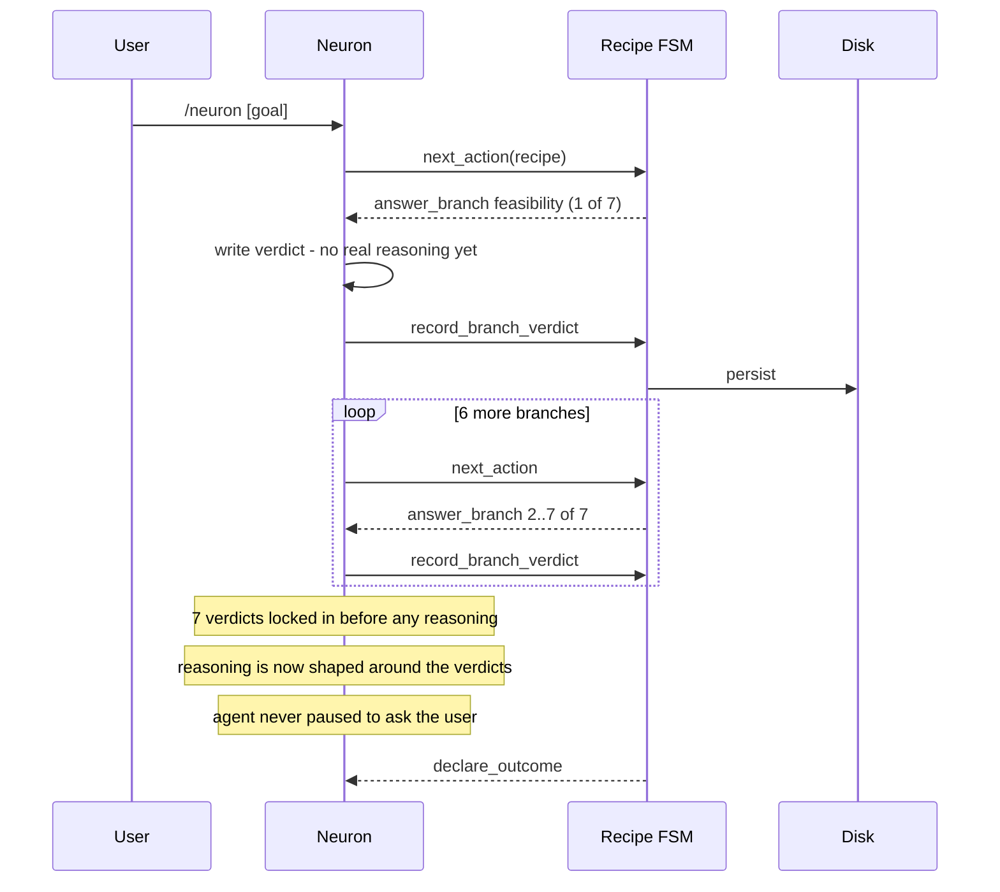
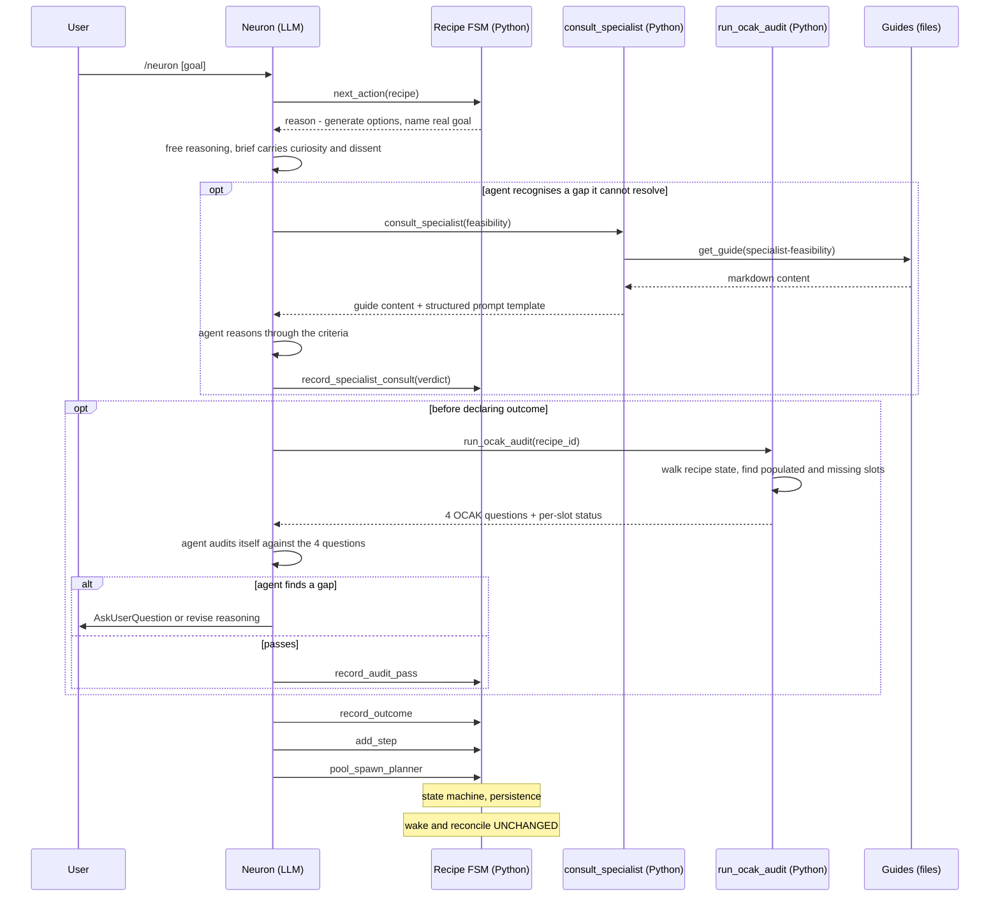
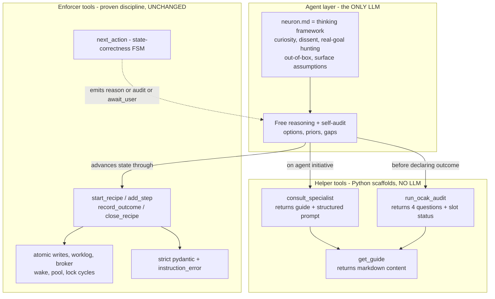

# OCAK as helper, not enforcer — design record (2026-05-20)

On-disk record of the architectural conversation that produced this
design. Saved here so the *why* survives compaction, not just the
*what*. The diagrams compile under mermaid 10.x+ (VS Code mermaid
plugin). Syntax rules used: no ` ` or `;` inside sequence-diagram
notes/messages (the parser there is stricter than flowchart labels);
`[goal]` not `<goal>` to avoid HTML interpretation.

## The finding

The OCAK we built in `recipe_fsm.py` is an inversion of the OCAK that
was originally designed. The original (preserved in
`evolving-deep-agent/docs/guides/framework-ocak.md`) is a
**post-reasoning audit** of 4 questions, applied AFTER the LLM
generates options, explicitly forbidden as a thinking lens. The
current FSM is a **pre-reasoning checklist** of 7 different questions,
forced one-at-a-time before any reasoning happens. Two distinct
mechanisms got conflated into a degraded version of neither:

- **OCAK (original)** = 4-question audit (Observation / Comprehension
  / Awareness / Concerns) — *post*-reasoning, validates completeness.
- **The 7 questions** (feasibility, role_clarity, actors, concerns,
  new_tech, estimation, goal_setter) = **branches handed to specialist
  leaf neurons** in the old aggregator design. Each leaf was its own
  shell doing real reasoning. They were *parallel specialists*, not a
  sequential checklist.

The new FSM took the specialists' branch questions, collapsed them
into a sequential pre-reasoning checklist on the recipe owner's
shoulders, mislabeled it OCAK, and dropped both the specialization
*and* the audit nature. The observable consequence: in the live
HITLs the agent never paused to ask the user a real question — it
mechanically answered all 7 branches with self-defined defaults, and
the post-reasoning audit (which is what would have caught the
self-resolved ambiguity) never ran because we never built it.

## Today's flow (the inversion)

## Where reasoning lives

Only ONE actor in either diagram is an LLM: **the neuron itself (N)**.
Every other box is deterministic Python or files. Helpers return
content and structure for the neuron to reason over; they do not
reason. Enforcers track state and persistence. See the **No LLM in
helper tools** principle below.

| Actor | Nature | Reasons? |
|---|---|---|
| `N` neuron | Claude shell | YES (the only LLM) |
| `FSM` recipe FSM | Python | no |
| `S` consult_specialist | Python helper | no — returns guide + prompt |
| `O` run_ocak_audit | Python helper | no — returns audit structure |
| `G` guides | markdown files | no |
| `U` user | human | (out of system) |

## Proposed flow (reason first, audit after, specialists on demand)

## Layered architecture (what stays, what is new)

## What changes vs what stays

**Stays (the proven discipline):** every enforcer. `next_action` state
machine, intent tools for outcome/step/close, atomic persistence,
worklog, broker/pool/wake/cron, strict pydantic schemas with
instruction-shaped errors, lock cycles. The wake fix, F1/F2
reconcile, close_recipe — untouched. Determinism where state
correctness matters is preserved.

**Changes:**
- `recipe_fsm.py` `COMPREHENDING` no longer seeds 7 branches. It emits
  one of: `reason` (default — free reasoning phase), `consult_specialist`
  (when the agent named a specific gap), `run_audit` (the agent declared
  it is ready), `await_user` (audit or agent surfaced ambiguity needing
  user input).
- New helper tools, **pure Python scaffolds — no LLM inside** (see the
  No LLM in helper tools principle below; an earlier draft of this doc
  had them LLM-driven, which contradicted the design intent):
  - `consult_specialist(specialist_id, query)` — loads the specialist
    guide and returns its content plus a structured prompt template the
    agent then reasons through.
  - `run_ocak_audit(recipe_id)` — walks recipe state, identifies which
    structural slots (real_goal, priors, instance-vs-class, K-tuple)
    are populated, returns the 4 OCAK questions plus per-slot status.
    The agent then audits itself against those questions.
- The 7 ex-leaves become **guides**
  (`docs/guides/specialist-feasibility.md`, etc.) — same content the old
  leaf-neuron skill bodies had, loaded on demand via `get_guide`, no
  shell.
- `docs/guides/framework-ocak.md` — the original 4-question audit
  ported verbatim.
- `neuron.md` rewritten as **thinking framework + curiosity ideology**.
  Today's protocol prose (heartbeat, close, broker recipients, wake)
  moves to `docs/guides/neuron-protocol-reference.md` loaded only when
  troubleshooting.

## The curiosity layer (where the ideology lives)

The brief teaches the neuron to:
- Hunt for the real goal vs the stated goal.
- Notice when it feels certain without evidence — pause.
- Notice when the user's ask seems small but implications are large —
  surface.
- Name assumptions explicitly when tempted to default.
- Imagine constraints are gone: would the plan change?
- Disagree with the user when warranted — propose a different goal.
- Bi-directional: a collaborator, not a servant.

The brief is short on protocol, long on this. The audit is the
back-stop when the brief alone is not enough: if the agent declared
outcome without surfacing the real-goal question, OCAK catches it.

## Trade-offs honestly named

1. **Brief alone may not produce curiosity.** Some models will still
   optimise shortest path even with a curiosity-heavy brief. *Mitigation:*
   the audit *structure* is forced by the FSM (a `run_audit` instruction
   the agent must address before declaring outcome). The audit is
   self-audit by the agent against a forced template — less of a
   back-stop than LLM-in-tool would have been, but the deliberate
   trade-off: preserve agent reasoning over enforcement of it. If a real
   second-perspective back-stop becomes necessary later, it is a
   session-neuron, not an LLM helper (see below).
2. **`run_ocak_audit` is deterministic structurally; the agent's
   audit-of-itself is LLM and not reproducible.** The slot-status the
   tool returns is the same for the same recipe; the agent's verdict on
   it is not. This is the right form of non-determinism (the LLM is the
   thinker). All audit verdicts are recorded in worklog so post-hoc
   review is possible.
3. **Over-consulting specialists.** Agent might consult when not
   needed. *Mitigation:* the brief sets norms; the run_ocak_audit
   slot-status report flags "consulted feasibility on a clearly-
   feasible task" as the anti-pattern.
4. **FSM exit from COMPREHENDING needs a new condition.** Today: 7
   branches resolved. New: `audit_status == passed` OR
   `audit_status == overridden_by_user` (preserves the original's
   "OCAK skipped for trivial goals" exception).
5. **The 7 ex-leaves and the 4 OCAK questions coexist.** They are
   different things: specialists answer domain questions, OCAK audits
   completeness regardless of which specialists were consulted. This is
   the original architecture restored, not a new invention.

## Principle: no LLM in helper tools

Helpers return content and structure. Reasoning happens in the agent
shell. The agent is the only LLM in the system's tool-call surface.

*Why this principle exists:* every time LLM judgement moves into the
tool boundary, the agent has one less reason to think for itself. Over
many calls, the effect compounds — the agent becomes a passive
executor of intelligent tools rather than the thinking center of the
system. Bounded LLM-in-tool ("just one question each") is still
LLM-in-tool; the "just one question" tools accumulate. This was the
slip caught in the 2026-05-20 conversation: an earlier draft of this
very doc had `consult_specialist` and `run_ocak_audit` described as
LLM-driven and labelled "bounded" — that re-introduced the smart-MCP
direction we had explicitly reversed three turns earlier.

*What helpers may do (deterministic):* presence checks, length checks,
schema validation, template rendering, vector-recall over indexed
memory, file reads, structured-prompt assembly, slot-status reports.

*What helpers may not do:* invoke an LLM to produce a verdict, choose
between options, generate new content, or judge the quality of another
actor's output.

*Enforcement:* a helper tool's `_run` method MUST NOT call out to an
LLM. This is a code-review invariant; if a use case demands LLM
judgement outside the agent shell, the answer is below.

## Noted but not built: session-neurons for genuine second-perspective review

If we ever need real LLM second-perspective review (a separate
intelligence reviewing the agent's reasoning rather than the agent
auditing itself), the right pattern is a **session-neuron** — a
separate claude shell spawned via the pool, broker-addressed, with its
own context and persistence. This is the `/critic` pattern from the
old cluster (ADR-024) for which the substrate already exists in this
stack (pool, broker, cron-wake, broker-recipient verbatim addressing).

This pattern is **noted but not built** in this design. We introduce
it only when a specific use case demands it — preemptive construction
risks the dilution this whole document warns against. The placeholder
name in the eventual implementation will be `consult_critic`
(broker-addressed, not an MCP tool), to distinguish it from the
helper-tool layer.

## Paper-debug walkthrough — "Build me a workout-tracking app"

**Today's path** (verified in code, observed in HITL): 7 forced
verdicts → agent self-resolves every ambiguity → declare_outcome with
self-defined criteria → planner builds a generic web app the user
never approved the shape of. No user interaction.

**Proposed path:**
1. Neuron reasons freely. Brief makes it ask: real goal — tracking or
   habit-formation? device — phone, web, doesn't matter? scope — solo
   or social?
2. Neuron recognises these are pre-reasoning blockers it cannot decide
   for the user. Surfaces an AskUserQuestion for the two it genuinely
   needs.
3. User clarifies. Neuron reasons again, drafts 3 directions
   (CSV log / mobile app / progressive-overload coach), considers
   priors.
4. Neuron invokes `run_ocak_audit`. The tool returns: the 4 OCAK
   questions plus slot-status ("real_goal: populated", "priors_checked:
   yes, see specialist consults", "instance_or_class: unset", "K_tuple:
   unset"). The **neuron** then audits itself against each:
   - O: priors observed (workout-app patterns) — pass
   - C: real goal stated explicitly — pass
   - A: instance — one-off project, instance is expected — flagged but
     not blocking
   - K: effort high if mobile, low if CSV — flagged for explicit choice
5. Neuron records the self-audit verdict (`record_audit_pass` with the
   per-question outcomes + K-flag) and declares outcome with explicit
   scope (MVP only).
6. add_step, spawn_planner. Planner now has a real scope to work with.

The forcing function gets *less* prescriptive (no seeded branches) and
*more* effective (audit catches what the agent skipped).

## Resolved decisions (2026-05-20)

User answers locked in:

1. **Layered shape** — confirmed: agent thinks, helpers scaffold,
   enforcers enforce. Only the neuron is LLM.
2. **Brief drafting mode** — claude writes a first version, user
   reviews and shares ideas as they strike. (Corrected from an earlier
   misread of "b" — the original option list had b = claude-drafts-
   user-reviews; this is the actual decision.)
3. **Audit invocation point** — BOTH: recipe-level audit before
   `record_outcome`, AND plan-level audit after planner generates
   options before `record_plan` sign-off. Original `framework-ocak.md`
   targets plan-level; the recipe-level form catches comprehension
   gaps the original was never asked to catch. Both fire under
   the same `run_ocak_audit` tool with a `scope` parameter.
4. **Sequencing** — confirmed:
   (a) specialist guides (port the 7 ex-leaves) — markdown only, lowest
       risk
   (b) helper tools (`consult_specialist`, `run_ocak_audit`,
       `get_guide`) — contained Python
   (c) FSM change in `recipe_fsm.py` COMPREHENDING — structural break
   (d) brief rewrite — user-drafted first, claude-redlined
5. **Porting the 7 ex-leaves** — light edit to remove shell-self-
   reference prose ("I am the X leaf"), otherwise verbatim. The
   criteria and anti-patterns are the value.
6. **Protocol-prose offload + caching** — see "Caching guides" below.
7. **Curiosity-layer testability** — accepted: live HITL is the only
   real signal. No synthetic test will catch this.
8. **Paper-debug scenarios** — accumulate in
   `docs/design/paper-debug/<scenario>.md`. These act as few-shot
   reference material for future scenarios. The workout-tracking-app
   walkthrough in this doc is the first; subsequent ones get their
   own files.

## Caching guides (decision 6 detail)

The brief's protocol-prose moves to `docs/guides/neuron-protocol-
reference.md`. The neuron calls `get_guide(name)` to retrieve it. The
question was whether to cache so repeated calls don't keep re-reading
the file.

Decision: **in-process LRU cache in the MCP server**, keyed by guide
name. Hot guides live in memory for the lifetime of the MCP server
process; cold start re-reads from disk. No new infrastructure. ~5-line
change in `get_guide`'s implementation. The MCP server is already a
long-running process; this is barely a cache, just don't-re-read-the-
file-every-call.

Not chosen:
- Broker-hosted cache: adds a network hop for content that lives a few
  millimetres away on disk. The user noted this would be overkill —
  agreed.
- Filesystem mtime invalidation: useful if guides edit live, but the
  guides are static between deploys. LRU + process-lifetime is enough;
  MCP server restart is the invalidation event.

If we ever need shared cache across multiple processes (e.g., a fleet
of MCP servers, which we don't have), the broker is where it goes —
not premature.

## Next concrete steps (in order)

1. **Port the 7 ex-leaves as guides.** Source:
   `evolving-deep-agent/.claude/commands/{feasibility-checker,role-
   clarity-checker,actor-identifier,actor-clarity-checker,concern-
   validator,new-tech-detector,estimation-checker,goal-setter}.md`.
   Target: `docs/guides/specialist-<name>.md`. Light edit only.
2. **Port `framework-ocak.md`** verbatim into `docs/guides/`.
3. **Build the three helper tools**: `get_guide(name)` with in-process
   LRU; `consult_specialist(specialist_id, query)` returning guide
   content + structured prompt template; `run_ocak_audit(scope,
   handle)` returning the 4 OCAK questions + per-slot status (scope =
   `"recipe"` | `"plan"`).
4. **Change `recipe_fsm.py` COMPREHENDING.** Stop seeding 7 branches.
   Emit `reason` / `consult_specialist` / `run_audit` / `await_user`
   based on state. New FSM exit condition:
   `audit_status in {"passed","overridden_by_user"}`.
5. **Add audit hook to `plan_fsm.py`.** Between option-generation and
   `record_plan`, emit `run_audit` with `scope="plan"`. Mirror the
   recipe-level discipline.
6. **Draft the brief** (decision 2 — claude drafts, user reviews):
   rewrite `neuron.md` as the thinking framework + curiosity ideology;
   extract today's protocol prose into `docs/guides/neuron-protocol-
   reference.md`. Land alongside steps 1-5 for the same HITL.

Each step is independently testable. The unit suite stays green at
every step; live multi-shell HITL after step 5 confirms the substrate;
live HITL after step 6 (with the new brief) confirms the curiosity
layer per decision 7.
