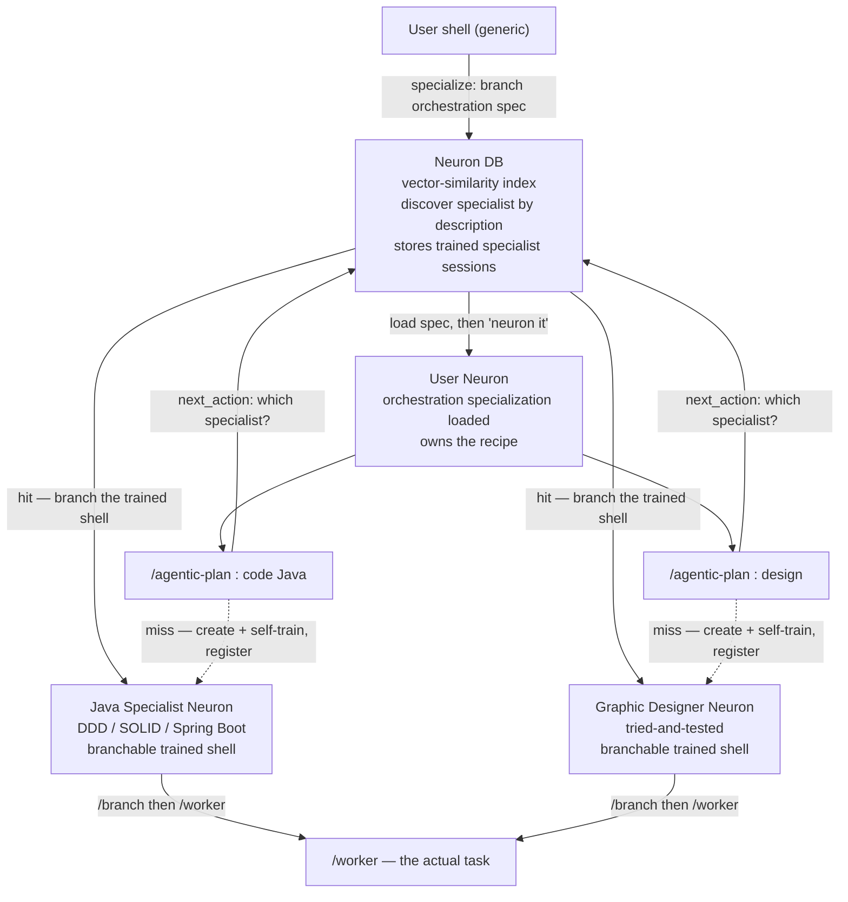
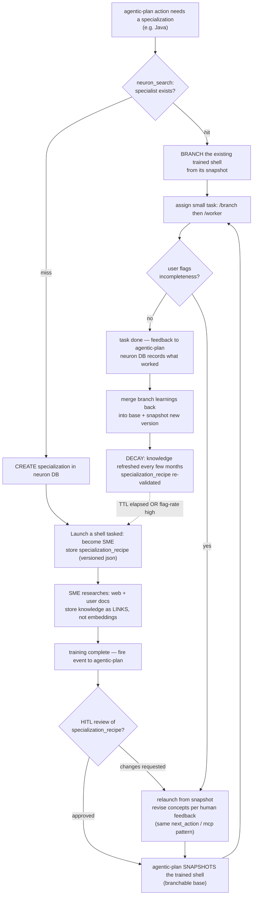

# Specialization neurons — vision (2026-05-22, draft for alignment)

This is my understanding of the user's "specialization neuron" vision,
the map to the current code, the diagrams, and the open questions. It
is a DRAFT for us to align on — nothing is built yet. Diagrams compile
under mermaid 10.x (VS Code plugin).

## The problem it solves (the WHY)

LLMs are token-completion systems: they generate by predicting the next
token, so they're strongest at what they've *seen*, weak at the novel,
and — as context grows — unable to reliably tell a right approach from
a wrong one. CLAUDE.md injects some standing context, but a single
shell holds only so much.

The fix: **persistent, tried-and-tested expert shells** that have
already absorbed (a) a specialization's current knowledge, (b) the
user's preferences/anti-patterns, and (c) what worked vs didn't on
past complex problems. Reusing such an expert means you don't
re-instruct "how to code/design" every time, and you get a reliable
judgment source the base model lacks. This is the **self-awareness /
durable-judgment layer** the user keeps pointing at.

## The core objects

1. **Specialization neuron** — a Claude shell that has been *trained*
   into a subject-matter expert (Java/DDD/Spring, React, Tailwind,
   grid layout, code review, test cases, graphic design, …). It holds
   the digested knowledge IN CONTEXT and is **branchable** (fork the
   trained base to do a task, keep the base for reuse).
2. **Neuron DB** — an indexed registry with **vector-similarity
   search**. Given a problem/skill description, it returns the closest
   matching trained specialist(s). It stores the worker/specialist
   shells that worked (their session ids / snapshots).
3. **specialization_recipe** — a versioned JSON: a rough step-wise
   document the specialist follows, plus **links** (URLs, user-doc
   paths) to the knowledge — NOT a vector-embedded copy of the
   content. Embeddings index the *discovery*; the knowledge itself is
   referenced by link (saves cost; serves as refresh reference
   points). Versioned so the specialist can fall back if a revision
   goes wrong.
4. **Memory layer** the specialist reaches via `next_action`:
   anti-patterns, work-order, the specialization_recipe, checklists,
   user preferences.

## Runtime topology (matches the user's drawing)

The orchestrator is **not special — it is itself a specialization.** A
generic user shell specializes (branches the orchestration
specialization) and *then* "neurons it" — so the neuron's deterministic
discipline + accumulated orchestration preferences come from a
versioned, trained, reviewed specialization, not a static skill file.

## Specialization lifecycle (the meat)

## How this maps to the CURRENT code

| Vision piece | Today in eda-base | Gap |
|---|---|---|
| User Neuron | `neuron.md` (5-phase main shell) | ✅ maps |
| /agentic-plan with associated specializations | `agentic-plan.md` (shape dispatcher) | partial — picks a *shape*, not a *specialist* |
| Neuron DB (vector similarity) | **nothing** | ❌ build (old ADR-024/025 SQLite-registry + embedding is the reference) |
| Specialist = living branchable shell | `worker` is ephemeral (spawn→reap); specialist *guides* are static docs | ❌ persistence + branch + snapshot missing |
| consult_specialist | loads a static markdown guide | partial — seed only; not a trained shell |
| specialization_recipe (versioned json) | recipe/plan ARE versioned json + intent tools + worklog | ✅ pattern reusable; object missing |
| Knowledge as links | nothing | ❌ build |
| next_action-driven specialist firing | next_action drives recipe/plan | ✅ pattern reusable |
| memory layer (anti-patterns, checklists, prefs) | `recall`/`remember` exist; anti-patterns are a `# TODO(memory-inject)` stub | partial |
| Snapshot / branch / resume / rollback | pool spawns fresh + reaps; **no resume/branch** | ❌ THE load-bearing primitive (see risk) |
| Decay / refresh | nothing | ❌ build |
| Embedding model | ollama deployed locally, **not wired** | ❌ wire (this is the legitimate ollama use: the discovery index) |

**Honest framing:** when we rebuilt eda-base we deliberately dropped
the old cluster's neuron registry (ADR-024/025) for determinism. This
vision brings it back — but *evolved*: persistent + branchable +
self-training + decaying, not just a routing table. The deterministic
spine we built (recipe/plan FSM, intent tools, versioned json,
worklog, broker, pool) is the substrate it runs on.

## Spike result (2026-05-22) — PASSED ✅

The load-bearing primitive is **real**. Branch/snapshot/resume is a
native Claude Code capability, and the pool is nearly ready for it.

**1. The branch primitive exists.** `claude --help` confirms:
- `-r, --resume <session_id>` — reload a trained session's context.
- `--fork-session` — *"When resuming, create a new session ID instead
  of reusing the original"*. **This IS branch:** `claude --resume
  <base> --fork-session` loads the trained base and forks it into a
  NEW session id; the base stays pristine.
- `--session-id <uuid>` — pin a session id; `--no-session-persistence`
  to opt out.

**2. Snapshot = the session_id.** Sessions persist as
`~/.claude/projects/<dir>/<session_id>.jsonl` (full conversation +
`file-history-snapshot` entries). A trained specialist's "snapshot" is
just its session_id; the jsonl is the durable record. No custom
snapshot machinery needed.

**3. The pool is ~ready.** `pty_launcher.build_argv(bin, extra)`
already returns `[bin, *extra]`, and `Launcher` takes argv directly.
Branching = `PoolService.spawn(..., resume_session=<base_id>)` plumbed
to the spawner as `extra=["--resume", <base_id>, "--fork-session"]`.
One new param, no new mechanism.

**4. Flow-back maps cleanly (decision #2) — no claude `rollback`
needed.** Base = a **session_id pointer** in the neuron DB.
- branch-for-task → `--resume <base> --fork-session` → new fork id.
- on acceptance → **promote** the fork's session_id to be the new base
  pointer + bump the specialization_recipe version (learnings flow
  back).
- on reject → discard the fork; base pointer unchanged.
- rollback → point base back to a prior session_id / recipe version.

So "learnings flow back" AND "versioned-recipe drift control" both work
with native primitives. The specialization_recipe fallback
(re-instantiate from links+steps) is no longer the *primary* path — it
is the **cold-start** path (first run, no base session yet) and a
secondary rollback anchor.

**Capturing the forked id:** `--fork-session` generates a new id; the
spawned shell reports it back (SessionStart hook → init.json, as the
old repo did, or via `pool_post_ready`). Small wiring. Confirmed
empirically that `claude -p ... --output-format json` returns the
session_id in its result envelope.

**Empirical proof (2026-05-22, live `claude -p` test):**
- Planted "magic codeword is BANANA42" in base `dee52ff9-…` via
  `claude -p "..." --session-id <base>`.
- Ran `claude -p "What is the codeword?" --resume <base>
  --fork-session --output-format json`.
- Result: forked `session_id = 94a62027-…` (**different** from base →
  base pristine) AND `result = "BANANA42"` (**trained context loaded
  into the fork, no re-training**).
- Conclusion: branch = resume+fork works exactly as the vision needs.

**Watch-item:** [[project_wake_resume_stale_input_replay]] (old repo:
`--resume` replayed a drained broker queue). With `--fork-session` the
fork gets a NEW id → a fresh broker inbox keyed to the new handle, so
the stale-replay class shouldn't recur — but verify in the first live
branch test.

## The load-bearing risk (verify FIRST, like the cron spike) — RESOLVED ABOVE

The whole thing rests on one unproven primitive: **can a trained
specialist shell be snapshotted and branched/resumed so its context is
reused without re-training?**

- `claude --resume <session_id>` exists (resumes a session).
- The user names `branch` and `rollback` — I'm not certain these exist
  as imagined (fork-a-session, revert-to-a-point). This needs a
  ~30-min spike before anything is built on it, exactly like the
  "does cron fire in a spawned shell" spike. If branch/snapshot isn't
  real, the fallback is: re-instantiate a specialist from its
  specialization_recipe (the versioned json + links) each time —
  slower (re-reads the recipe) but no shell-fork needed. That fallback
  is why the specialization_recipe matters even if branch works.

## Resolved decisions (2026-05-22)

1. **Unified model — comprehension checkers are SUBSUMED.** There is
   ONE neuron DB. The current comprehension specialists (feasibility,
   role-clarity, actor-id, concern-validator, new-tech-detector,
   goal-setter) become *entries in it*, alongside domain experts
   (Java, React, …). Everything is a specialization; OCAK/comprehension
   is one cluster of specialists among many. → big unification: the
   aggregator pulls comprehension specialists from the same DB it pulls
   domain experts from.
2. **Branch learnings FLOW BACK into the base.** A branch isn't a pure
   throwaway — after a task completes + is accepted, its learnings
   merge back into the base shell and a new base snapshot is taken, so
   the specialist genuinely gets smarter over time. **Drift control:**
   the *versioned* specialization_recipe is the durable, reviewable,
   rollback anchor — even though the live shell mutates, every merge
   produces a new recipe version you can fall back to; the HITL review
   (#3) and decay re-validation (#4) are the correctors.
3. **HITL review gate before a new specialization is usable.** When a
   specialist self-trains, it must present its specialization_recipe
   for approval before it's used on real work. Lifecycle gains a
   `pending_review` state between "trained" and "stable".
4. **Decay = TTL OR feedback, whichever fires first.** A timestamp
   clock (e.g. 90 days) AND a flag-rate threshold both trigger
   re-validation; re-validation re-enters the train→review flow.
5. **The neuron/orchestrator is ITSELF a specialization.** There is no
   privileged "neuron role" hardcoded in a skill file. A generic user
   shell *specializes* (branches the orchestration specialization from
   the neuron DB) and *then* "neurons it" — runs as the recipe-owning
   orchestrator. Its deterministic discipline (phase-driving, recipe
   ownership) AND the user's accumulated orchestration preferences live
   in that versioned, trained, HITL-reviewed specialization, so the
   neuron becomes consistent/deterministic and improvable the same way
   every other specialist does — not re-derived ad hoc each session.
   `/neuron` becomes a thin bootstrap: discover/branch the orchestration
   spec → load → drive. **This resolves Point 20 elegantly:** a
   specialist "neuron-ing itself" is just *loading the orchestration
   specialization* — no special hierarchy-inversion machinery; any
   specialized shell can load orchestration and spawn neuron-services.

## What I'd propose as the build order (once aligned + spike passes)

1. ~~**Spike (GATING)**~~ ✅ 2026-05-22 — `--resume <base>
   --fork-session` proven live (see Spike result above).
2. ~~**Neuron DB**~~ ✅ 2026-05-22 — `NeuronStore` (SQLite, embedding
   BLOB) + `EmbedPort` (StubEmbed offline / HttpEmbed ollama
   `nomic-embed-text`). Tools: `neuron_search` (cosine; degrades to
   `search_text` token-overlap when ollama down), `neuron_get/list/
   set_status/set_base_session/touch/flag`. Validated lifecycle
   TRANSITIONS (HITL gate) + flow-back base pointer + decay signals.
   **nomic prefix finding:** `search_query:`/`search_document:` are
   LOAD-BEARING (without them ranking inverts); carried by
   `EmbedPort.embed(text, kind)`. Verified live.
3. ~~**specialization_recipe**~~ ✅ 2026-05-22 — `Specialization`
   (versioned) + `SpecStore` (versioned-json + snapshots + worklog =
   rollback anchor). Tools: `create_specialization` (bootstraps
   neuron@pending_review + spec v1 + embedding), `add_spec_entry`
   (knowledge-as-links + memory layer), `record_spec_version`,
   `get_specialization`. claude 124→126 (+13), tool count 36→47.
4. ~~**Self-train flow + HITL review gate**~~ ✅ 2026-05-22 —
   `spawn_specialist` (PoolPort + stub + http + launcher activator
   `specialist`→`/specialist`); `train_specialist` tool (consult-
   before-spawn: posts {subject, description, category} to the SME
   inbox, then spawns a FRESH `/specialist`); `specialist.md` brief
   (research current sources → create_specialization → add_spec_entry
   knowledge-as-links → record_spec_version → submit `pending_review`
   → notify training_complete → close; anti-patterns: no writing from
   memory, no self-approval, no doing the downstream task).
   create_specialization now starts at `trained` (SME researches THEN
   authors), submits to `pending_review` (the HITL gate). claude
   126→130, tool count 47→48. **Scope boundary:** phase 4 produces the
   durable specialization_recipe; capturing the SME's session_id as
   the branchable BASE belongs with phase 5 (branch-for-task) — the
   pool will spawn with a pre-generated `--session-id` so the base id
   is known up front.
   training-complete event back to agentic-plan + the `pending_review`
   surfacing to the user (decision #3).
5. ~~**Branch-for-task + flow-back merge**~~ ✅ 2026-05-22 — branch
   mechanics SPIKED LIVE: `--resume <base> --session-id <fork>
   --fork-session` forks a base into a KNOWN fork id (context loads,
   base intact); `--session-id`+`--resume` requires `--fork-session`
   (CLI-enforced). Pool: `build_session_args` + `claude_session`/
   `resume_session` threaded through Spawner→service→`/v1/spawn`.
   `spawn_branch` (worker branched from base) + `spawn_specialist`
   gains `claude_session` (pins the base id at train time). Tools:
   `branch_specialist` (requires stable + based; posts task, spawns
   fork, returns known fork id) + `flow_back_learnings` (promote-fork-
   on-accept → new base + recipe checkpoint; reject = don't call, base
   untouched). train_specialist pins the base id; SME records it via
   `neuron_set_base_session`. claude 130→134, pool 30→32, tool count
   48→50. **revise-on-feedback** (relaunch-from-snapshot on flagged
   work) folds into phase 9 decay/re-validation.
6. ~~**Subsume comprehension specialists**~~ ✅ 2026-05-22 (decision
   #1) — `seed_comprehension_specialists` registers the 8 shipped
   comprehension specialists (feasibility/role-clarity/actor-identifier/
   actor-clarity/concern-validator/new-tech-detector/estimation/
   goal-setter) into the neuron DB as `stable` (pre-approved, no HITL),
   `editable=False` (protected), guide-backed seeds (no base_session_id
   → consulted via guide, not branched). neuron_id == guide id so
   `consult_specialist(<id>)` works on a discovered seed. Idempotent.
   neuron-phase-b.md rewritten: seed → `neuron_search` to DISCOVER
   relevant specialists → consult, instead of a hardcoded list. claude
   134→139, tool count 50→51.
7. ~~**Wire agentic-plan**~~ ✅ 2026-05-22 — `Action.specialization`
   (+`add_action` param): the planner tags actions needing domain
   expertise. `dispatch_action` surfaces it. agentic-plan.md dispatch:
   specialization set → `neuron_search` → stable+domain+based match →
   `branch_specialist(plan_id, action_id)` (the branch IS the action's
   worker — same `plan_id:action_id` lock + reconciliation +
   outcome-verify, but trained context loaded); no match → fresh
   `pool_spawn_worker` now (non-blocking) + optional `ask_above`
   suggesting the neuron `train_specialist` for future reuse.
   `branch_specialist` gained action-integrated mode (handle =
   plan_id:action_id, reads action from plan, no task message). claude
   139→141, tool count unchanged (51).
8. ~~**Orchestration as a specialization**~~ ✅ 2026-05-22 (decision
   #5) — `ensure_orchestrator` (idempotent cold-start floor) creates the
   `orchestrator` specialization (category=orchestration, status=stable,
   editable=True) seeded with the 5 phase-guide links + hard-won
   orchestration anti-patterns (don't-execute-inline, always-heartbeat-
   on-wait, surface-blocked-states) + work-order. `/neuron` Step 0:
   `ensure_orchestrator()` → `get_specialization("spec-orchestrator")` →
   LOAD the discipline + accumulated preferences into its own context,
   then drive. **Note:** the main shell can't fork itself, so "branch"
   for the orchestrator = LOAD the recipe (not spawn a process — that's
   workers). **Self-improvement loop closed:** when the user flags an
   orchestration mistake, the neuron `add_spec_entry`s an anti_pattern →
   next session inherits it. claude 141→145, tool count 51→52.
9. ~~**Decay/refresh**~~ ✅ 2026-05-22 (decision #4) — `check_specialist_
   decay` is a deterministic ON-DEMAND detector (NOT a polling daemon —
   honors the "eager watchdogs produce no learning signal" lesson): a
   stable/underused neuron is stale when TTL elapsed (now - trained_at >
   ttl_days) OR flag-rate high (flag_count >= min_flags AND
   flag_count/use_count >= threshold), whichever first. Pure compute —
   reports, doesn't mutate. The neuron acts: `neuron_set_status
   pending_review` → revise recipe → re-approve (revise-on-feedback via
   existing tools, no new machinery). Orchestrator seed gained a
   work_order: check decay on-demand before reusing a specialist.
   claude 145→150, tool count 52→53.

**BUILD COMPLETE (2026-05-22).** All 9 phases done. Final: claude 150,
pool 32, broker 14, contracts 38, integration 3; ruff clean across all.
Tool count 36→53 (+17 specialization tools). The branch primitive is
proven live; the full lifecycle — discover → train → review → branch →
flow-back → decay → re-validate — exists end-to-end, and everything
(domain experts, comprehension checkers, the orchestrator itself) lives
in one neuron DB. Not yet exercised in a live HITL run.

Each phase is independently testable on the deterministic substrate we
already have. Point-20 (specialists orchestrating) is resolved by
decision #5 — no separate role-graph work needed.
