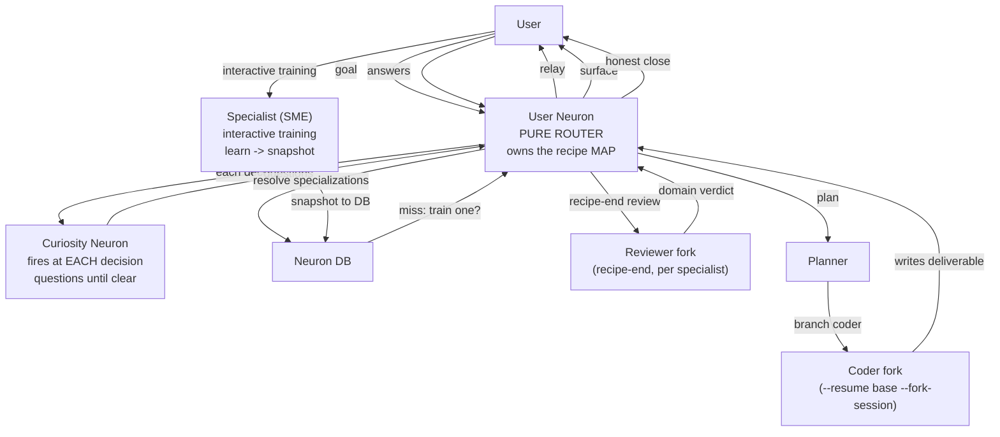

# v2 — recipe-as-map, neuron-as-router, curiosity + two-fork specialists

Date: 2026-05-22. Driven by the Java-REST HITL review (`neuron.txt` /
`planner.txt`) which exposed that the neuron acts like the *brain*
(decides alone, hand-drives around the FSM, closes a lying recipe)
instead of a *router*. This doc captures the v2 design the user
specified in response.

## The principle

A human neural network. Messages flow neuron→neuron; each neuron does
its part. The **recipe is the shared map** every neuron reads and
writes. The **user neuron only coordinates** — it does NOT comprehend,
research, decide, code, verify, or close-on-faith. The other neurons
are **the means to the goal, not advisors the neuron consults at whim.**

Corollary: **the map must never be compromised.** A recipe that closes
`succeeded` with pending steps, or whose back half ran outside the FSM,
is a broken map. The neuron must be *unable* to route around it.

## The HITL failures this fixes (evidence)

- Neuron decided "where to build" alone (`neuron.txt:188`) → clobbered
  the live repo's `.gitignore`; surfaced it only AFTER, unrecoverably.
  → the user holds ground truth the neuron skipped asking for.
- Recipe closed `succeeded` with s2/s3 `pending` (plans were terminal;
  steps never reconciled). `close_recipe` has no guard.
- Deferred-last-step trap: `reviewing` never reopens for a new pending
  step, so s2/s3 ran outside the FSM (hand-dispatched + broker-polled).
- Specialist training never fired (pure neuron discretion); review
  rested on a planner's bare `plan_closed`, no captured evidence.

## v2 decisions (locked)

1. **Recipe-map integrity (FSM can't lie).**
   - `reviewing` → `planning` reopens when a new `pending` step is
     added (deferring later steps when clarity is low is GOOD — the map
     is built in phases, but stays coherent).
   - `close_recipe` REFUSES `succeeded`/`done` while any step is
     `pending`/`in_progress`; reconciles steps whose plans are terminal.
   - The wait/heartbeat reminder text reinforces *drive via `next_action`
     / the MCP procedure — never hand-dispatch around the map.*

2. **Curiosity neuron — fires at EACH decision point.** A session-neuron
   that lives outside the user neuron and interrogates it until the goal
   (or the specific decision) is **clear**. Not a one-shot comprehension
   pass — it is the gate on every decision the neuron would otherwise
   make alone: comprehension, framework, **workspace/location**, scope,
   cost, technology. It questions; the neuron relays to the user;
   loops until "clear". It can direct the neuron to *research the
   subject* (consult a specialist). The neuron does not decide alone.

3. **Training is mandatory + interactive + up-front.**
   - At planning, the neuron resolves ALL specializations the map needs;
     `neuron_search` misses are SURFACED to the user (*"no specialist
     for X — train one?"*), never silently fallen back. Not discretion.
   - Training is an **interactive session with the user**: the SME shell
     is user-facing; the user injects/refines the specialization prompt;
     the SME asks clarifying questions; it interacts **through that shell
     until the user declares training complete.** The SME KNOWS it will
     be **forked for many use cases**, so it learns the subject
     *generally*, not for the one task.
   - Then: **learn → snapshot → fork-from-snapshot.** The base snapshot
     is NEVER the worker — it stays pristine; every use is a fork.

4. **Two-fork specialists + domain review replaces /critic.**
   - One fork **codes** the action (the phase-7 branch).
   - At **recipe end**, a fresh fork of **each specialist that did work**
     reviews the final deliverable in its domain — real domain-expert
     verification, replacing the planner's "succeeded" on faith.
   - **/critic is retired.** The domain reviewer-fork is the review
     mechanism. The process-level "pivot the whole approach?" lens moves
     up front to the curiosity neuron + the neuron acting on the domain
     verdict at close.

5. **Neuron = pure router.** The neuron's brief is rewritten so it
   delegates comprehension (curiosity), research/advice (specialists,
   accessible to neuron AND planner), planning (planner), execution
   (coder-forks/workers), and review (reviewer-forks). It only routes
   messages and maintains the recipe map.

## New mechanism this requires

**User ↔ spawned-shell interaction.** Today spawned shells are headless.
v2 needs two interaction patterns:
- **Curiosity → user**: relayed through the user neuron (broker → neuron
  → AskUserQuestion). Already possible.
- **User ↔ SME (training)**: DIRECT — the user converses with the
  spawned specialist shell. Mechanism: the pool's **monitor mode**
  (visible console, `console_launcher`) so the shell is user-facing, or
  a broker-relayed Q&A loop. Decide at build time.

## v2 flow

## Implementation phases (proposed order)

- **v2.1 — Recipe-map integrity** (decision #1). Isolated, low-risk,
  fixes the lying-recipe + deferred-step bugs. FOUNDATION — the map must
  be trustworthy before neurons rely on it. (FSM reopen + close guard +
  reminder text.)
- **v2.2 — Curiosity neuron** (decision #2). Session-neuron + per-decision
  spawn + the interrogation loop + the workspace/location question.
- **v2.3 — Interactive + mandatory training** (decision #3). User-facing
  SME shell + up-front specialization resolution + surface-to-user.
- **v2.4 — Two-fork + domain review, retire /critic** (decision #4).
- **v2.5 — Neuron-as-router brief rewrite** (decision #5). Ties it
  together; the neuron stops doing, starts routing.

Start at v2.1 (correctness, unblocks honest recipes); v2.3 feeds v2.4;
v2.5 last.

## BUILD STATUS — all phases COMPLETE (2026-05-22)

- **v2.1 ✅** FSM `reviewing`→`planning` reopen on a new pending step;
  `close_recipe` refuses `succeeded`/`done` over pending/in_progress
  steps + reconciles terminal-plan steps; wait-reminder reinforces
  drive-via-next_action.
- **v2.2 ✅** Curiosity neuron: `spawn_curiosity` + `consult_curiosity`
  (consult-before-spawn) + `/curiosity` brief (interrogate
  location/cost/tech/scope until clear, never decide for the user) +
  phase-B rewritten to drive curiosity per decision, not reason alone.
- **v2.3 ✅** Interactive + mandatory training: `spawn_specialist`
  gains `mode` → `train_specialist` spawns **monitor (visible) mode**
  + `interactive=True`; `/specialist` brief converses with the user,
  learns generally (knows it'll be forked), trains until the user says
  done; agentic-plan resolves specializations UP FRONT and surfaces
  "train one?" (mandatory, not silent fallback).
- **v2.4 ✅** Two-fork + domain review **replaces /critic**: `spawn_branch`
  gains `role`; `branch_reviewer` forks a `reviewer` from the
  specialist base; `/reviewer` brief; phase-E forks a domain reviewer
  per specialist used before an honest close. `consult_critic` +
  `spawn_critic` + `critic.md` + `critic-review.md` REMOVED; all guide/
  brief references rewired to `branch_reviewer` / curiosity.
- **v2.5 ✅** Neuron-as-router: neuron.md "How to think" reframed
  (router, not the brain; neurons are the means, not advisors;
  delegate comprehension/research/planning/execution/review); the
  router principle baked into the orchestrator spec seed.

**Final: claude 164, pool 32, broker 14, contracts 38, integration 3;
ruff clean across all. Tool count 53→54** (+consult_curiosity,
+branch_reviewer, −consult_critic). Unit-tested; NOT yet exercised in a
live HITL run (the monitor-mode interactive-training is the one piece
that needs a live spike — can't unit-test "user types into a visible
shell").
