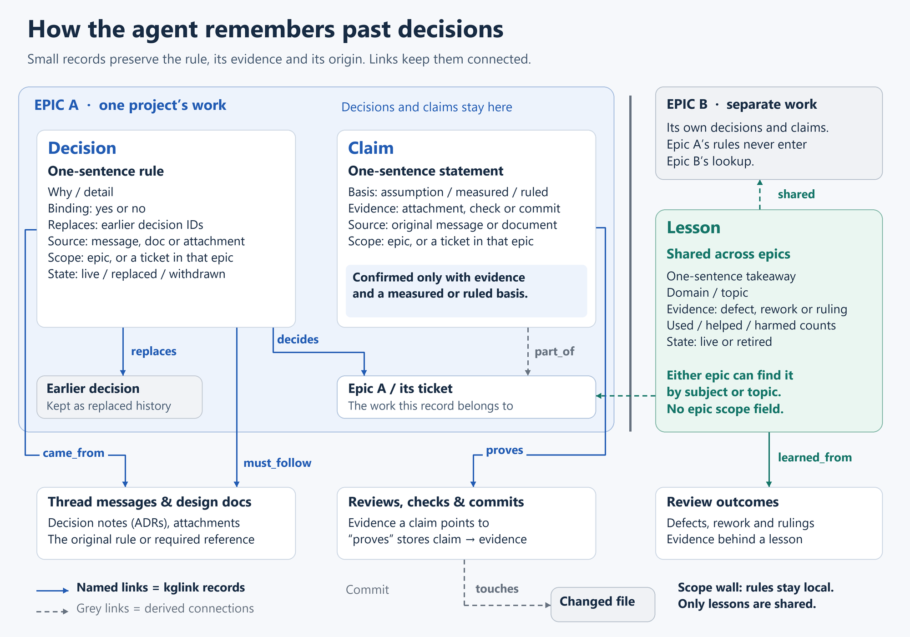
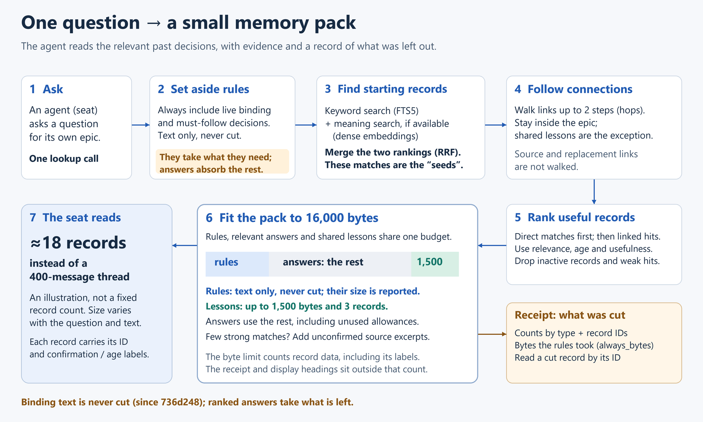

# The memory layer

A long epic produces hundreds of messages. A new seat cannot read them all, and should not have to.
So the board keeps small records next to the conversation, and a seat asks for the few that matter.

- **Decision**: one sentence that rules on something, with why, where it came from, and the earlier
  decisions it replaces. A **binding** decision is a rule every seat on the epic must follow; only the
  architect or owner can make one.
- **Claim**: one sentence stated as fact, with its basis (assumption, measured, ruled) and the evidence
  that proves it.
- **Lesson**: a takeaway shared across epics by topic, with helped/harmed counts.
- **Links** join them: *replaces*, *decides*, *proves*, *came from*, *must follow*, *learned from*.
  Decisions and claims stay inside their epic; only lessons cross over.

`lookup(question)` returns one **memory pack** capped at **16,000 bytes** (commit `7d6d065`, owner
ruling m-5e2ff72e19). Binding rules always come first and are never cut. Keyword search (SQLite
FTS5) and meaning search (local embeddings, optional) find the starting records. Links are followed
for up to two steps, the results are ranked, and a receipt lists what did not fit, so the seat can
fetch it by id.

The diagrams' source and notes live in [`v8/docs/kg/`](../../v8/docs/kg/).

**Measured.** `python -m edp8.exam` replays a fixed question set through `lookup`. On a private
30-question exam, two readers answered **only** from the packs, and the same graders marked both
runs (board message m-c1fd89db5e, board at `7d6d065`):

| Reader | Pack | Correct | Partial | Wrong | Not in pack |
|---|---|---|---|---|---|
| Claude Opus | 8 KB | 17 | 3 | 2 | 8 |
| Claude Opus | **16 KB** | **20** | 5 | **0** | 5 |
| GPT-6 Astra | 8 KB | 18 | 1 | 1 | 10 |
| GPT-6 Astra | **16 KB** | **21** | 4 | **0** | 5 |

Both readers miss the same five questions. Four of those five have a live record that ranks below the
cut, and the fifth was never recorded. Better ranking, not a bigger pack, is the next step.

