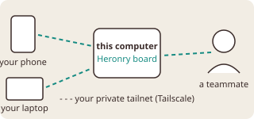
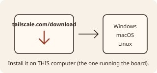
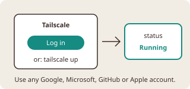
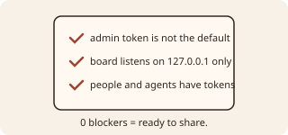
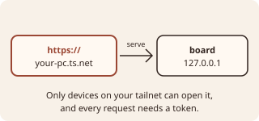
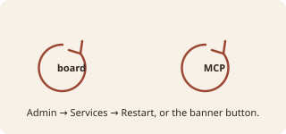

# Remote access: reach this board from another device

Admin → Remote access walks through these same steps and checks each one live. This guide is the
written copy. The diagrams live in `assets/guides/remote-access-*.svg`.

## 1. What it is for

Heronry runs on one computer. Out of the box only that computer can open the board. Remote access lets
other devices reach it: your own phone or laptop, and teammates you invite.

It uses [Tailscale](https://tailscale.com), a free private network ("tailnet") between your own
devices. The board is never exposed to the open internet. Only devices signed in to your tailnet can
reach it, and every request still needs a Heronry token.

## 2. Install Tailscale on this computer

Install it on the computer that runs the board:

- **Windows:** <https://tailscale.com/download/windows>
- **macOS:** <https://tailscale.com/download/mac>
- **Linux:** <https://tailscale.com/download/linux> (one line: `curl -fsSL https://tailscale.com/install.sh | sh`)

**Done when** the page shows Tailscale as detected. The page runs `tailscale status` for you.

## 3. Sign in

Open the Tailscale app and log in, or run `tailscale up` in a terminal. Any Google, Microsoft, GitHub or
Apple account works. Sign in the same way on each device that should reach the board (your phone, your
laptop). Teammates join through the invite link from Admin → Teammates.

**Done when** `tailscale status` reports **Running** and a machine name such as
`your-pc.tail1234.ts.net`. Then press **Check again** on the page.

## 4. Readiness

Before sharing, the page checks that:

- the admin token is not the default;
- the board listens on `127.0.0.1` only;
- people and agents have tokens.

Each blocker names its fix. Most are fixed by the next step itself.

**Done when** it shows 0 blockers. The command-line twin is `edp.ps1 tailnet check`.

## 5. Serve the board on your tailnet (public mode)

Turn on **Public mode** on the page. It runs
`tailscale serve --bg --https=443 http://127.0.0.1:<board port>` and records the resulting URL
(`https://<your machine>.ts.net`) as the board's public URL. Teammate invites then carry that URL.

Turning public mode off runs `tailscale serve reset` and returns the board to this-computer-only.

**Done when** the page shows the public URL and `tailscale serve` forwards to the board.

## 6. Restart the board and MCP

The board and the MCP server read the public URL when they start. Press the **Restart board** and
**Restart mcp** buttons in the banner, or use Admin → Services.

**Done when** the public URL opens the board from your phone or laptop.

## Troubleshooting

- **Tailscale not detected.** Install it (step 2). On Linux, check that `tailscaled` is running
  (`sudo systemctl enable --now tailscaled`).
- **"Stopped" or "NeedsLogin".** Sign in (step 3).
- **"X is set by the environment".** A real environment variable beats Heronry's config file. Remove it
  where the page says, then try again.
- **Teammates cannot open the URL.** They must be signed in to your tailnet. Share your tailnet with
  them from the Tailscale admin console, or give them a Tailscale auth key from Admin → Teammates.
